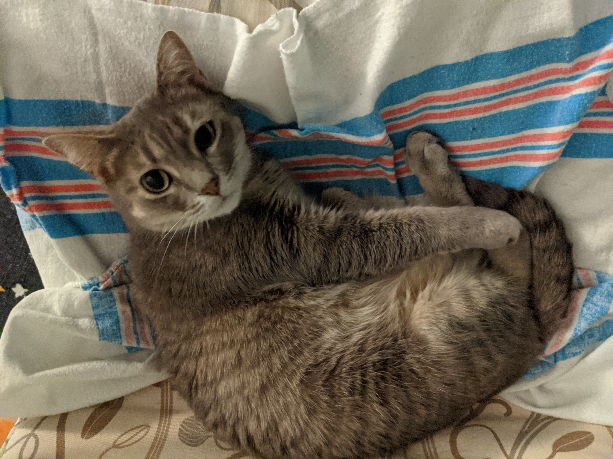

<style>
.forceBreak { -webkit-column-break-after: always; break-after: column; }
</style>

<!-- To render the lecture in Rmarkdown, enter the command below in the R console -->
<!-- rmarkdown::render("lecture15.Rmd") -->

```{r,echo=FALSE}
	#set any global options
	options(digits=3)
	set.seed(123)
```

## Hello!

I am Emily Josephs

- interested in: evolutionary genetics, plants, triathlons, cat

## Hello!

I am Emily Josephs

- interested in: evolutionary genetics, plants, triathlons, cat

```{r, out.width="500px",echo=FALSE,fig.align="center"}
	
```

## Fun around Lansing: Hawk Island Park

```{r, out.width="500px",echo=FALSE,fig.align="center"}
	
```


## Fun around Lansing: Hawk Island Park

```{r, out.width="300px",echo=FALSE,fig.align="center"}
	
```

\

Free parking at the Scott's Woods entrance

## 1st semester goals 

1. Data into spreadsheet

2. Wrangle data into R

3. Visualize data

4. Build a model
	+ how are data distributed?
	+ relationship between predictor and response?

5. Use algorithm to parameterize model

6. Interpret results


## 1st semester goals 

1. ~~Data into spreadsheet~~

2. ~~Wrangle data into R~~

3. ~~Visualize data~~

4. Build a model
	+ how are data distributed?
	+ relationship between predictor and response?

5. Use algorithm to parameterize model

6. Interpret results


## IBio 830, part II {.build}

### Covering: 
 * probability
 * probability distributions
 * likelihood
 * likelihood-based inference
 * Bayesian inference
 * deterministic functions
 * model building

**Still using R, but focus won't be on the language itself!**


## 

```{r, out.width="750px",echo=FALSE,fig.align="center"}
	
```


## Shaping Expectations {.build}

This part of the course may feel like it moves a little faster.

There will be math!

You will be learning a new skill, using a young skill, which is hard!

The material will build on itself.

I am learning along with you!!!

ALSO:

Everything else in the world is happening!!!

## How to take this part of the course {.build}

1. take a deep breath!

2. believe in yourself!!!

3. remember that your primary goal is _present_ understanding, 
but a solid secondary goal is _future_ understanding.

4. try to stay on top of the work.

5. don't be afraid of office hours!!

## Why am I doing this to you? {.build}

Many of you got into this business because of a love of nature, 
not a love of stats and computers.

Our goal is to try to translate your love of _nature_ 
into a love of _patterns_, and give you the tools to do so!

Biology has become a driver of quantitative methods in STEM 
because interesting patterns are sublte and complicated.

Also, employment!

## Today's lecture - Intro to Probability! {.build}

How do you define probability?

\

A measure of the likelihood that an event will occur

A long-term frequency

How often we expect an event to happen ('degree of belief')

## How I use probability  {.build}
 Will I get to Park Place?

```{r, out.width="600px",echo=FALSE,fig.align="center"}
	knitr::include_graphics("figs/monopoly.png")
```

\
Which definition matches the probability of landing on Park Place?

## How I use probability  {.build}
When will I give birth?

```{r, out.width="600px",echo=FALSE,fig.align="center"}
	knitr::include_graphics("figs/duedate1.png")
```

\

Which definition matches the probability of giving birth on a specific day?

## How I use probability  {.build}
Who will win the election?

```{r, out.width="300px",echo=FALSE,fig.align="center"}
	knitr::include_graphics("figs/electiondial.png")
```

\

Which definition matches the probability of an election outcome?


## Today's rules of probability:  {.build}

The probability of an **_outcome_** is the number of times the outcome occurs divided by the total number of trials.

A **_simple event_** consists of a single experiment and has a single outcome

The sum of the probabilities of **_all possible outcomes_** of an event is equal to 1.

The probability of a **_shared event_** is the product of the probabilities of its constitutive events, so long as they're independent.

The probability of a **_complex event_** is the sum of the probabilities of its constitutive events.

The sum of the probabilities of **_all possible outcomes_** of an event is equal to 1.


## Notation note {.build}

A **set** is an unordered set of objects.

S = {1,2,3,4,5}

S = {1,2,3,4,5} = {4,3,2,5,1}

The intersection of two sets is all the elements that appear in **both** sets.

{1,2,3} $\cap$ {2,3,4} = {2,3}

The union of two sets is every element that appears in **either** set.

{1,2,3} $\cup$ {2,3,4} = {1,2,3,4}

## Probability: Simple Events {.verybig .build}

I have a set {1,2,3,4,5}

What's the probability that, if I draw a number at random, 
I'll get a 5?

This is a **_simple event_** - 

* it consists of a single experiment (drawing a random number) 
* and has a single outcome (the number drawn)


## Probability: simulation is your friend! {.verybig}

```{r,eval=FALSE}
help(sample)
```

## Probability: simulation is your friend! {.verybig}

```{r}
numbers <- c(1,2,3,4,5)
sample(numbers,1)
```

```{r}
sample(numbers,1)
```

```{r}
sample(numbers,1)
```


## Probability: simulation is your friend! {.verybig}

```{r,eval=FALSE}
numbers <- c(1,2,3,4,5)
sample(numbers,1)
```

\

Working in breakout rooms, figure out a way 
to use a large-scale simulation (1e5 trials) to 
estimate the probability of picking a 5 in the following set:

{1,2,3,4,5}

* hint - look at the documentation for `sample()`!

## Probability: simulation is your friend! {.verybig .build}

```{r}
numbers <- 1:5
nDraws <- 1e5
mySamples <- sample(numbers,nDraws,replace=TRUE)
```

```{r}
length(which(mySamples==5))/nDraws
1/5
```

## Probability - some terminology {.big .build}

We denote the probability of an event with **_P()_**.

So, we can write the probability of a simple event **_e_** as:

\

<div class ="centered">
$\Large P(e)$
</div>


as in:

<div class ="centered">
$\Large P(\text{drawing a }5) = \frac{1}{5}$
</div>

## Probability: simple events {.build}

<div class ="centered">
$\Large p(\text{drawing a }5) = \frac{1}{5}$
</div>

\

What's the probability of drawing a 4 out of {1,2,3,4,5}?

\

$\Large P(4) = P(5) = P(1) = P(2) = P(3) = \frac{1}{5}$


## First Axiom of Probability: {.build}
\
The Law of Total Probability:
\
<div class ="centered">
$\Large \sum\limits_{i=1}^n P(e_{i}) = 1$
</div>

The sum of the probabilities of all the outcomes of an event is 1

$\Large P(4) + P(5) + P(1) + P(2) + P(3) = 1$


## Rules of probability: recap {.build}

The probability of an **_outcome_** is the number of times the outcome occurs divided by the total number of trials.

A **_simple event_** consists of a single experiment and has a single outcome

The sum of the probabilities of **_all possible outcomes_** of an event is equal to 1.

## Probability: shared events {.build}

A **_shared event_** is the simultaneous occurrence of simple events

The probability of a shared event is denoted P(A $\cap$ B)

(read as probability of the _intersection_ of simple events A and B)

E.g., probability of drawing 2 numbers and getting a 4 AND a 5

the probability of a shared event is the product of the probabilities
 of its constitutive simple events
 
[As long as the simple events are **independent**, meaning that the 
outcome of one event does not depend on the outcome of another.]


## Probability: simulating shared events {.build}

\

```{r}
numbers <- 1:5
```

What's the probability you draw the sequence (4,5), 
in that order?


## Probability: simulating shared events

```{r,cache=TRUE}
nDraws <- 1e5
## sample two dice rolls for nDraws times.
two.draws <- replicate(nDraws,
					sample(numbers,2,replace=TRUE),
			  simplify=FALSE)
```			  

```{r}
## get the proportion of draws that are equal to 
length(	which(	unlist(
			lapply(two.draws,	function(x){sum(x==c(4,5))}))==2)
)/nDraws
```

## Probability: shared events {.build}

the probability of a shared event is the product of the probabilities
 of the simple events that make up the shared event:
 
 
$\Large p(4 \text{ in first draw}) = \frac{1}{5}$
$\Large p(5 \text{ in second draw}) = \frac{1}{5}$
$\Large p(\text{sequence } (4,5) ) = \frac{1}{5} \times \frac{1}{5} = 0.04$


## Rules of probability: recap

The probability of an **_outcome_** is the number of times the outcome occurs divided by the total number of trials.

A **_simple event_** consists of a single experiment and has a single outcome

The sum of the probabilities of **_all possible outcomes_** of an event is equal to 1.

The probability of a **_shared event_** is the product of the probabilities of its constitutive events, so long as they're independent.

The probability of a **_complex event_** is the sum of the probabilities of its constitutive events.

## Probability: complex events {.build}

**_Complex events_** are composites of simple events

\

e.g., rolling two dice and summing their values

\

The probability of a complex event is the sum of the probabilities 
of the simple events that make up the complex event
 
## Probability: simulating complex events {.build}

```{r}
numbers <- c(1,2,3,4,5)

```

\

If I draw **two** numbers at once, 
what's the probability that they sum to 6?

Return to breakout rooms and update your simulations to test this.


```{r cache=TRUE}
two.draws <- numeric(1e5)
for(i in 1:1e5){
	two.draws[i] <- sum(
						sample(1:5,2,replace=TRUE)
				 	)
}

length(which(two.draws==6))/1e5
```

## Probability: simulating complex events

```{r}
numbers <- c(1,2,3,4,5)

```

\

If I draw **two** numbers at once, 
what's the probability that they sum to 6?


```{r cache=TRUE}
two.draws <- replicate(1e5,
					sum(
						sample(1:5,2,replace=TRUE)
				 	)
			 )
length(which(two.draws==6))/1e5
```

## Probability: complex events {.build}

If I draw **two** numbers at once, 
what's the probability that they sum to 6?

The total *state space* is 5 $\times$ 5 outcomes, 
each of which is equi-probable (1/25).

And can get a 6 with 5 outcomes:

	{(1,5),(2,4),(3,3),(4,2),(5,1)}

So the probability of drawing two numbers that sum to 6 
is the sum of the probabilities of the simple events 
that make up that complex event.

$\large P(a + b = 6) = \frac{1}{25} + \frac{1}{25} + \frac{1}{25} + \frac{1}{25} + \frac{1}{25} = \frac{1}{5}$

## Probability: complex events {.build}

In general,

$\large P(E_{1} + E_{2}) = P(E_{1}) + P(E_{2})$

If $E_{1}$ and $E_{2}$ are mutually exclusive events

(This is also an axiom)

## Rules of probability: recap

The probability of an **_outcome_** is the number of times the outcome occurs divided by the total number of trials.

A **_simple event_** consists of a single experiment and has a single outcome

The sum of the probabilities of **_all possible outcomes_** of an event is equal to 1.

The probability of a **_shared event_** is the product of the probabilities of its constitutive events, so long as they're independent.

The probability of a **_complex event_** is the sum of the probabilities of its constitutive events.


## Probability: sparkly shoes {.big .build}

You record the hair color and shoe phenotype of all the kids in a daycare.

```{r echo=FALSE}
nTots <- 100
brnHair <- rbinom(1, nTots,0.6)
blkHair <- nTots - brnHair
plnShoe <- rbinom(1, nTots,0.8)
sprklShoe <- nTots - plnShoe
brnpln <- round(nTots * (brnHair/nTots * plnShoe/nTots))
brnsprkl <- brnHair - brnpln
hair_shoe <- matrix(c(brnpln,brnsprkl,plnShoe - brnpln,sprklShoe - brnsprkl),nrow=2,ncol=2,byrow=TRUE)
row.names(hair_shoe) <- c("black hair","brown hair")
colnames(hair_shoe) <- c("plain","sparkly")
```

 `r knitr::kable(hair_shoe,align="c")`
 \
If you pick a kid at random, what is the probability they have black hair and sparkly shoes?


## Daycare example: simple event {.build}

 `r knitr::kable(hair_shoe[1:2,1:2],align="c")`

```{r,echo=FALSE}
hair_shoe <- cbind(hair_shoe,rowSums(hair_shoe))
hair_shoe <- rbind(hair_shoe,colSums(hair_shoe))
row.names(hair_shoe)[3] <- "total"
colnames(hair_shoe)[3] <- "total"
```
\
If you pick a kid at random, what is the probability they have black hair and sparkly shoes?

`r hair_shoe[1,2]/100`
\


## Daycare example: complex event {.build}

`r knitr::kable(hair_shoe[1:2,1:2],align="c")`

\

What's the probability of having black hair?

\

Note that there are now **two** categories of kids with black hair: 
the plain-shoed and the sparkle-shoed.


## Daycare example: complex event {.build}

`r knitr::kable(hair_shoe[1:2,1:2],align="c")`

\

What's the probability of having black hair?
\

p(black hair) = 
p(black hair AND plain shoes) + p(black hair AND sparkly shoes)
= `r (hair_shoe[1,2]/100) + (hair_shoe[1,1]/100)`

## Daycare example: shared event {.build}

What's the probability of picking two kids that both have black hair and sparkly shoes?

\

`r knitr::kable(hair_shoe[1:2,1:2],align="c")`

\

p(black hair and sparkly shoes) x p(black hair and sparkly shoes)
= `r (hair_shoe[1,2]/100)^2`


## Rules of probability: thus far {.build}

1. The probability of an **_outcome_** is the number of times the outcome occurs divided by the total number of trials.

2. The probability of a **_complex event_** is the sum of the probabilities of its constitutive events.

3. The probability of a **_shared event_** is the product of the probabilities of its constitutive events, so long as they're independent.

4. The sum of the probabilities of **_all possible outcomes_** of an event is equal to 1.

## Conditional probabilities

`r knitr::kable(hair_shoe,align="c")`

\
\
\
- probability of sparkly shoes **IF** you have black hair?


## Conditional probabilities

- a **_conditional probability_** is the probability of one outcome _conditional_ on another

- written as p(A | B), read as "probability of A _given_ B"

- probability of the intersection of A and B, divided by the probability of B

<div class ="centered">
$\Huge p(A|B) = \frac{p(A ~ \cap ~ B)}{p(B)}$
</div>

## Conditional probabilities

```{r, out.width="500px",echo=FALSE,fig.align="center"}
	knitr::include_graphics("figs/conditionalprob.jpg")
```

<div class ="centered">
$\Huge p(A|B) = \frac{p(A ~ \cap ~ B)}{p(B)}$
</div>

## Conditional probabilities

`r knitr::kable(hair_shoe,align="c")`

\
\
- probability of sparkly shoes **IF** you have black hair?

## Conditional probabilities

`r knitr::kable(hair_shoe,align="c")`

\
\
- probability of sparkly shoes **IF** you have black hair?
\
\
-p(A | B) = p(A $\cap$ B)/p(B) =

## Conditional probabilities

`r knitr::kable(hair_shoe,align="c")`

\
\
- probability of sparkly shoes **IF** you have black hair?
\
\
-p(A | B) = p(A $\cap$ B)/p(B) = `r hair_shoe[1,2]` / `r hair_shoe[1,3]` = `r hair_shoe[1,2] / hair_shoe[1,3]`


## Conditional probabilities {.build}

- recall that if A and B are independent, p( A $\cap$ B) = p(A) * p(B)

- so if A and B are independent:

<div class ="centered">

$\Large
\begin{aligned}
 p(A \mid B) &= \frac{p(A ~ \cap ~ B)}{p(B)} \\
\\
&= \frac{p(A)p(B)}{p(B)} = p(A)
\end{aligned}$
</div>

## Conditional probabilities {.build}

`r knitr::kable(hair_shoe,align="c")`

\

Does a kid's hair color affect the probability that their parents will get them 
a sweet pair of sparkly shoes?

p(sparkle shoes | black hair) = `r (hair_shoe[1,2]/hair_shoe[1,3])`

p(sparkle shoes) = `r (hair_shoe[3,2]/hair_shoe[3,3])`

## Rules of probability: recap {.build}

1. The probability of an **_outcome_** is the number of times the outcome occurs divided by the total number of trials.

2. The probability of a **_complex event_** is the sum of the probabilities of its constitutive events.

3. The probability of a **_shared event_** is the product of the probabilities of its constitutive events, so long as they're independent.

4. The sum of the probabilities of **_all possible outcomes_** of an event is equal to 1.

5. A **_conditional probability_** is probability of one outcome _conditional_ on another, 
and is equal to the probability of the intersection of the outcomes, 
divided by the probability of the condition

## {.build}

You roll a pair of 4-sided dice 100 times in a row and record the combination of numbers you get 
(1st roll in row, 2nd roll in col):

```{r echo=FALSE}
rawRolls <- lapply(1:1e2,function(i){sample(1:4,2,replace=TRUE)})
rolls <- matrix(NA,nrow=4,ncol=4)
for(i in 1:4){
	for(j in 1:4){
		rolls[i,j] <- sum(unlist(lapply(rawRolls,function(x){identical(x,c(i,j))})))
	}
}
colnames(rolls) <- 1:4
row.names(rolls) <- 1:4
```

`r knitr::kable(rolls,row.names=TRUE,align="c")`
\
<div class ="centered">
**POLL** - _p_(the first roll is a "1")?
</div>

**A** - `r rolls[1,1]`/`r sum(rolls)` \
**B** - (`r rolls[1,1]`+`r rolls[1,2]`+`r rolls[1,3]`+`r rolls[1,4]`)/`r sum(rolls)` \
**C** - (`r rolls[1,1]`+`r rolls[2,1]`+`r rolls[3,1]`+`r rolls[4,1]`)/`r sum(rolls)` \
**D** - `r rolls[1,1]`/(`r rolls[1,1]`+`r rolls[2,1]`+`r rolls[3,1]`+`r rolls[4,1]`) \

##

You roll a pair of 4-sided dice 100 times in a row and record the combination of numbers you get 
(1st roll in row, 2nd roll in col):

`r knitr::kable(rolls,row.names=TRUE,align="c")`
\
<div class ="centered">
**POLL** - _p_(the first roll is a "1")?
</div>

A - `r rolls[1,1]`/`r sum(rolls)` \
<span style="color:red">**B - (`r rolls[1,1]`+`r rolls[1,2]`+`r rolls[1,3]`+`r rolls[1,4]`)/`r sum(rolls)` ** </span>\
C - (`r rolls[1,1]`+`r rolls[2,1]`+`r rolls[3,1]`+`r rolls[4,1]`)/`r sum(rolls)` \
D - `r rolls[1,1]`/(`r rolls[1,1]`+`r rolls[2,1]`+`r rolls[3,1]`+`r rolls[4,1]`) \

## 

You roll a pair of 4-sided dice 100 times in a row and record the combination of numbers you get 
(1st roll in row, 2nd roll in col):

`r knitr::kable(rolls,row.names=TRUE,align="c")`
\
<div class ="centered">
**POLL** - Expected _p_(rolling (2,2))?
</div>

**A** - $\frac{1}{4} \times \frac{1}{4}$          
**B** - $\frac{1}{4} + \frac{1}{4}$ \
**C** - ${(\frac{1}{4}})^{4}$

## 

You roll a pair of 4-sided dice 100 times in a row and record the combination of numbers you get 
(1st roll in row, 2nd roll in col):

`r knitr::kable(rolls,row.names=TRUE,align="c")`
\
<div class ="centered">
**POLL** - Expected _p_(rolling (2,2))?
</div>

<span style="color:red">**A - $\frac{1}{4} \times \frac{1}{4}$ **</span> \
B - $\frac{1}{4} + \frac{1}{4}$ \
C - ${(\frac{1}{4}})^{4}$

## 

You roll a pair of 4-sided dice 100 times in a row and record the combination of numbers you get 
(1st roll in row, 2nd roll in col):

`r knitr::kable(rolls,row.names=TRUE,align="c")`
\
<div class ="centered">
**POLL** - Expected _p_(sum of both rolls is greater than 3)?
</div>

**A** - $\frac{1}{4} \times \frac{1}{4} \times \frac{13}{16}$ \
**B** - $\frac{13}{16}$ \
**C** - $\frac{1}{2}$

## 

You roll a pair of 4-sided dice 100 times in a row and record the combination of numbers you get 
(1st roll in row, 2nd roll in col):

`r knitr::kable(rolls,row.names=TRUE,align="c")`
\
<div class ="centered">
**POLL** - Expected _p_(sum of both rolls is greater than 3)?
</div>

A - $\frac{1}{4} \times \frac{1}{4} \times \frac{13}{16}$ \
<span style="color:red">**B** - $\frac{13}{16}$ </span>\
C - $\frac{1}{2}$

## 

You roll a pair of 4-sided dice 100 times in a row and record the combination of numbers you get 
(1st roll in row, 2nd roll in col):

`r knitr::kable(rolls,row.names=TRUE,align="c")`
\
<div class ="centered">
**POLL** - Expected _p_(sum of both rolls > 3 _given_ first roll is a 1)?
</div>

**A** - $\frac{1}{4} \times \frac{1}{4}$\
**B** - $\frac{2}{16}$ \
**C** - $\frac{1}{2}$

## 

You roll a pair of 4-sided dice 100 times in a row and record the combination of numbers you get 
(1st roll in row, 2nd roll in col):

`r knitr::kable(rolls,row.names=TRUE,align="c")`
\
<div class ="centered">
**POLL** - Expected _p_(sum of both rolls > 3 _given_ first roll is a 1)?
</div>

A - $\frac{1}{4} \times \frac{1}{4}$\
B - $\frac{2}{16}$ \
<span style="color:red">**C** - $\frac{1}{2}$</span>