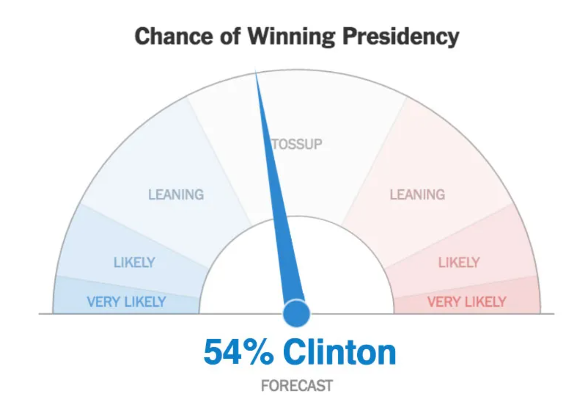

<style>
.forceBreak { -webkit-column-break-after: always; break-after: column; }
</style>

<!-- To render the lecture in Rmarkdown, enter the command below in the R console -->
<!-- rmarkdown::render("lecture15.Rmd") -->

```{r,echo=FALSE}
	#set any global options
	options(digits=3)
	set.seed(123)
```

## Hello!

I am Emily Josephs

- interested in: evolutionary genetics, plants, triathlons, cat

## Hello!

I am Emily Josephs

- interested in: evolutionary genetics, plants, triathlons, cat

```{r, out.width="500px",echo=FALSE,fig.align="center"}
	knitr::include_graphics("figs/kittykitty.jpg")
```

## 1st semester goals 

1. Data into spreadsheet

2. Wrangle data into R

3. Visualize data

4. Build a model
	+ how are data distributed?
	+ relationship between predictor and response?

5. Use algorithm to parameterize model

6. Interpret results


## 1st semester goals 

1. ~~Data into spreadsheet~~

2. ~~Wrangle data into R~~

3. ~~Visualize data~~

4. Build a model
	+ how are data distributed?
	+ relationship between predictor and response?

5. Use algorithm to parameterize model

6. Interpret results


## IBio 830, part II {.build}

### Covering: 
 * probability
 * probability distributions
 * likelihood
 * likelihood-based inference
 * deterministic functions
 * model building

**Still using R, but focus won't be on the language itself!**


## Shaping Expectations {.build}

This part of the course may feel like it moves a little faster.

There will be math!

You will be learning a new skill, using a young skill, which is hard!

The material will build on itself.

I am learning along with you!!!

ALSO:

Everything else in the world is happening!!!

## How to take this part of the course {.build}

1. take a deep breath!

2. believe in yourself!!!

3. remember that your primary goal is _present_ understanding, 
but a solid secondary goal is _future_ understanding.

4. do the homework and the self-reflections.

5. visit me and Sophie in office hours

## Office hours!

Office hours are Mondays 2-4pm in PLB 266 or on zoom.

Zoom Room: https://msu.zoom.us/my/emjos (Password: plantsrule)


## Today's lecture - Intro to Probability! {.build}

Why do we care about probability?
- Many important biological processes are influenced by chance
- We don't want to tell science stories about coincidences.
- Understanding probability helps us understand statistics.

## How do you define probability? {.build}

\

A measure of the likelihood that an event will occur

A long-term frequency

How often we expect an event to happen ('degree of belief')

## How I use probability  {.build}
 Will I get to Park Place?

```{r, out.width="600px",echo=FALSE,fig.align="center"}
	knitr::include_graphics("figs/monopoly.png")
```

\
Which definition matches the probability of landing on Park Place?

## How I use probability  {.build}
When will I give birth?

```{r, out.width="600px",echo=FALSE,fig.align="center"}
	knitr::include_graphics("figs/duedate1.png")
```

\

Which definition matches the probability of giving birth on a specific day?

## How I use probability  {.build}
Who will win the election?

```{r, out.width="300px",echo=FALSE,fig.align="center"}
	
```

\

Which definition matches the probability of an election outcome?


## Today's class  {.build}

Building an intuition for how the rules of probability work using simulations.

## Simulating data

Simulations?

```{r, out.width="500px",echo=FALSE,fig.align="center"}
	knitr::include_graphics("figs/sims.jpg")
```

## Simulating data

One of the most powerful tools that we'll have in our statistics learning toolkit are simulations.

Simulations let you generate data that you know should look a certain way, so you can test your intuitions.

Simulations also let you do the same thing over and over and over.

## Simulating data {.build}

```{r}
thisClass = 1:35

thisClass
```

```{r}
sample(thisClass, size=1)

```

## Simulating data {.build}

```{r}
sample(thisClass, size=1)
```

```{r}
sample(thisClass, size=1)
```

## Questions we can answer with simulations

If we randomly pick a student, how likely are we to select student #19?

If we randomly pick 10 students, how likely are we to select student #19?

If we randomly pick 2 students, how likely are we to select students #19 and #20?

## Simulating students

If we randomly pick a student, how likely are we to select student #19?
```{r}

mySamples <- replicate(10000, sample(thisClass, size=1))
sum(mySamples==19)/10000

```

## Sample space {.build}

To think about probability, we start with the set of all potential outcomes (the "sample space")

For example, when you flip a coin the potential outcomes are heads and tails.

What was the sample space for our class example?

## Ball pit

```{r, out.width="600px",echo=FALSE,fig.align="center"}
	knitr::include_graphics("figs/fallingballs.gif")
```

The sample space for this example is that (<span style="color:#EDA158;">A</span>), The ball can fall through the orange bin, (<span style="color:#62CAA7;">B</span>) the ball can fall through the green bin, and (<span style="color:#98C5EB;">C</span>) the ball can fall through the blue bin

## Out in sample space {.build}

If we do something, one of the things in the sample space will happen.

Therefore, the probabilities of all the outcomes in the sample space will sum to one.

This is the **Law of Total Probability**

## Estimating probabilities {.build}

Looking at one short time from the previous example:

```{r, out.width="600px",echo=FALSE,fig.align="center"}
	knitr::include_graphics("figs/stillballs.jpeg")
```

What proportion of balls belong to each outcome?

<span style="color:#EDA158;">A</span> = 10/15

<span style="color:#62CAA7;">B</span> = 2/15

<span style="color:#98C5EB;">C</span> = 3/15

These proportions are an estimate of the true probability based on one sample.

## Probability distribution (sneak peak) {.build}

```{r}
mycols =  c("#EDA158","#62CAA7","#98C5EB")
barplot(c(10/15,2/15,3/15), col=mycols, xlab = "probability", 
        ylab = "sample space")

```


## Exclusive events {.build}

Outcomes that cannot occur at the same time are **mutually exclusive**.

For example, a coin could be heads or tails but not both.

But, a coin could be both heads up and a quarter. These would be **non-exclusive events**

## Simulating exclusive events {.build}

Let's write a simulation of the ball example with 500 balls. 

```{r}
myN <- 500
pA = 3/6
pB = 1/6
pC = 2/6

mySample = sample(x=c("A","B","C"), 
                  size = myN,
                  replace=TRUE,
                  prob = c(pA, pB, pC))

```

## Summarizing the outcome of the simulation {.build}

```{r}

propA = sum(mySample=="A")/myN
propB = sum(mySample=="B")/myN
propC = sum(mySample=="C")/myN

mycols =  c("#EDA158","#62CAA7","#98C5EB")
barplot(c(propA, propB, propC), col=mycols, xlab = "probability", 
        ylab = "proportion", names.arg = c('A','B','C'))
```

## How many balls fell through A or B?

Work with your groups to calculate the probability of A or B happening.

## How many balls fell through A or B? {.build}

One way to solve the problem:

```{r}
propAorB = sum(mySample=="A") + sum(mySample=="B")
propAorB/myN

```

OR

```{r}
propAorB = 1 - propC
propAorB
```

## Simulating a sampling distribution

What if we want to simulate many samples to get a **sampling distribution** of how likely we are to get A or B?

## Simulating many samples

```{r}
nReps <- 100

sampleFunction <- function(myN){
                  mySample = sample(x=c("A","B","C"), 
                  size = myN,
                  replace=TRUE,
                  prob = c(pA, pB, pC))
                  
                  propA = sum(mySample=="A")/myN
                  propB = sum(mySample=="B")/myN
                  propC = sum(mySample=="C")/myN
                  
                  return(propA + propB)
                  }

mySamples <- replicate(nReps, sampleFunction(500))
```

## Visualizing the sample distribution

```{r}
hist(mySamples, main="", xlab = "proportion A or B")
```

## Non-exclusive events

What if events are not exclusive?

```{r, out.width="600px",echo=FALSE,fig.align="center"}
	knitr::include_graphics("figs/indep.gif")
```

