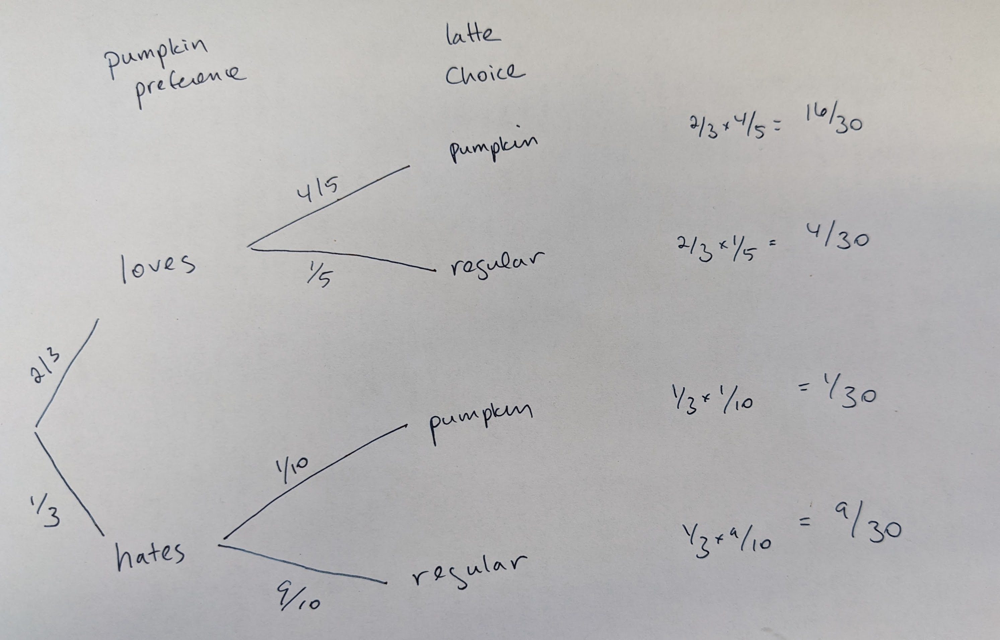

<style>
.forceBreak { -webkit-column-break-after: always; break-after: column; }
</style>

<!-- To render the lecture in Rmarkdown, enter the command below in the R console -->
<!-- rmarkdown::render("lecture16.Rmd") -->

```{r,echo=FALSE}
	#set any global options
	options(digits=3)
	set.seed(123)
```

## Simulation recap from last class

## The terminal vs Rstudio

Most of you are using Rstudio. How is that different from what I'm doing on the terminal?

## Replace?

```{r}
day<- function(n) { 
  return(sample(1:7,n,replace=TRUE))
}
```

What does replace do?

## Comparing the output of replace=TRUE and replace=FALSE

```{r}
sample(1:7,7,replace=TRUE)


sample(1:7,7,replace=FALSE)
```

## Comparing the output of replace=TRUE and replace=FALSE

What if we sample 8 things?


## Setting seed

```{r}
sample(1:7,1)
sample(1:7,1)
sample(1:7,1)

```

## Setting seed
```{r}
set.seed(5)
sample(1:7,1)
set.seed(5)
sample(1:7,1)
```


## Conditional example

We'll do this at the end!!!

## Math for probability {.build}

Are we always going to use simulations to learn about probability?

No!

Math is also helpful

- No uncertainty

- Fast

- Builds intuition


## Probability rules! {.build}

1. Add probabilities to find the probability of one outcome **OR** another (complex event).

2. Multiply probabilities to find the probability of one outcome **AND** another (shared event).

## Notation note {.build}

$P(a)$ is the probability of *a*.

$P(a \cap b)$ is the probability of *a* and *b* ($\cap$ = "intersection")

$P(a | b)$ is the probability of a given b.


## Adding probabilities for OR statements {.build}

$P(a \text{ or } b) = P(a) + P(b) - P(a \cap b)$

What's going on?

## Adding probabilities -- special case {.build}

If outcomes are mutually exclusive, then $P(a \cap b) = 0$ and

$P(a \text{ or } b) = P(a) + P(b)$

For example, let's say we all walk to Strange Matter and buy one drink. The probability that someone bought a latte or a cappuccino is P(latte) + P(cappuccino) because it would have been impossible to buy both a latte and a cappuccino.

## Adding probabilities {.build}

What if we want to know the probability that someone got a latte or they got a drink with oat milk? 

P(latte or oat) = P(latte) + P(oat) - P(oat latte)

We need to subtract the people who got oat lattes because, otherwise, they'd be double counted.

## Practice questions {.build}

Everyone in the class (n=30) goes to Strange Matter and each person buys one drink. They get:

10 Oat Lattes

15 Regular Lattes

5 Americanos

What is the probability that I (Emily) got an Americano?


What is the probability that Sophie got an Americano?


What is the probability that I (Emily) got an Oat Latte or an Americano?


## Multiplying for AND statements {.build}

$P(a \cap b) = P(a) \times P(b|a)$

or

$P(a \cap b) = P(b) \times P(b|a)$


## Multiplying probabilities -- special cases {.build}

If both outcomes are independent, then $P(b|a) = P(b)$ and $P(a|b) = P(b)$

so

$P(a \cap b) = P(a) \times P(b)$

At Strange Matter this time, 15 students get Americanos and 15 students get Lattes. We also get snacks, 20 students get donuts and 10 students get scones. 

If there is no relationship between drink and snack purchase, what is the probability that a student gets an Americano and a donut?

## Multiplying probabilities -- special cases {.build}

At Strange Matter this time, 15 students get Americanos and 15 students get Lattes. We also get snacks, 20 students get donuts and 10 students get scones. 

If there is no relationship between drink and snack purchase, what is the probability that a student gets an Americano and a donut?

P(Americano) = 15/30 = 1/2, P(donut) = 20/30 = 2/3

P(Americano and donut) = P(Americano) x P(donut)= 1/3

## Practice problem (in teams)

At Strange Matter this time, 15 students get Americanos and 15 students get Lattes. We also get snacks, 20 students get donuts and 10 students get scones. 

Assuming there is no relationship between drink and snack purchase,

What is the probability that a student gets an Americano **and** a scone?

What is the probability that a student gets an Americano **or** a scone?

## Conditional probabilities {.build}

Everyone in the class (n=30) goes to Strange Matter and each person buys one drink. They get:

10 Oat Lattes

15 Regular Lattes

5 Americanos

If Emily cannot drink regular milk, what is the probability that she gets an Americano?

P(Emily has an Americano| no milk) = number of Americanos/number of non-milk drinks = 1/3

## Conditional probabilities practice

Everyone in the class (n=30) goes to Strange Matter and each person buys one drink. They get:

10 Oat Lattes

15 Regular Lattes

5 Americanos

If Emily is allergic to oats, what is the probability that she gets a regular latte?


## Putting it all together {.build}

It's pumpkin latte season! Out of the 30 people in the class, 20 love pumpkin spice and 10 hate pumpkin spice. For the people who love pumpkin spice, they will get a pumpkin latte 4/5 of the time. For the people who hate pumpkin spice, they will get a pumpkin latte 1/10 of the time (just to see if they still hate it).

We all go to Strange Matter and get drinks. What are all the drink outcomes we could have?

Loves pumpkin, gets pumpkin latte: 

Loves pumpkin, gets regular latte: 

Hates pumpkin, gets pumpkin latte: 

Hates pumpkin, gets regular latte: 

## Putting it all together

It's pumpkin latte season! Out of the 30 people in the class, 20 love pumpkin spice and 10 hate pumpkin spice. For the people who love pumpkin spice, they will get a pumpkin latte 4/5 of the time. For the people who hate pumpkin spice, they will get a pumpkin latte 1/10 of the time (just to see if they still hate it).

We all go to Strange Matter and get drinks. What are all the drink outcomes we could have?

Loves pumpkin, gets pumpkin latte: (2/3) x (4/5) x 30 = 16

Loves pumpkin, gets regular latte: (2/3) x (1/5) x 30 = 4

Hates pumpkin, gets pumpkin latte: (1/3) x (1/10) x 30 = 1

Hates pumpkin, gets regular latte: (1/3) x (9/10) x 30 = 9

## Putting it all together {.build}

Sophie gets a pumpkin latte. What is the probability that she loves pumpkin spice?

There are two possibilities here: 1) Sophie got a pumpkin latte and loves pumpkin spice and 2) Sophie got a pumpkin latte and hates pumpkin spice.

p(pumpkin latte \cap love) = 16/30

p(pumpkin latte \cap hate) = 1/30

Out of 17 outcomes, 16 of them are someone who loves pumpkin spice.

So p(loves pumpkin spice | pumpkin latte) = 16/17

## Pumpkin spice {.build}
We can formalize this intuition with a Bayes Theorem.

$P(\text{ loves } | \text{ pumpkin latte }) = \frac{P(\text{pumpkin latte }| \text{ loves}) \times P(\text{loves})}{P(\text{pumpkin latte})}$

P(loves) = 20/30

P(pumpkin latte | loves) = 4/5

P(pumpkin latte) = 17/30

## Bayes Theorem !?!?

$P(H | D ) = \frac{P(D | H) \times P(H)}{P(D)}$

## Another strategy

It can be hard to keep track of all of this. Probability trees are a tool to help. To make a probability tree, we   

1. Write down all potential outcomes for *a*, and use lines to show their probabilities.  
2. We then write down all potential outcomes for *b* separately for each potential *a*, and connect each *a* to these outcomes with a line denoting the conditional probabilities.   
3. Keep going for events *c*, *d*, etc...    
4. Multiply each value on path to get the probability of that path.     
5. Add up all paths that lead to the outcome you are interested in. <span style="color:lightgrey;">(NOTE: Again, each path is exclusive, so we don't subtract anything.)</span>   

## Probability trees

```{r, out.width="700px",echo=FALSE,fig.align="center"}
	
```


## Team problem:

Sarah is doing a mark-recapture experiment with guppies. In March, she catches guppies in a specific pool, including a really cute guppy she names Bob. 

In April, she goes back to the pool to try to recapture these guppies. She knows, from experience, that if a guppy is alive, she has a 90% chance of catching it. She also expects that about 10% of her guppies have died. 

Sarah can't find Bob. What is the probability that Bob is dead?

## Probability challenge!

Flip a fair coin 100 times—it gives a sequence of heads (H) and tails (T). 

For each HH in the sequence of flips, Alice gets a point; for each HT, Bob does, so e.g. for the sequence THHHT Alice gets 2 points and Bob gets 1 point. 

Who is most likely to win?


