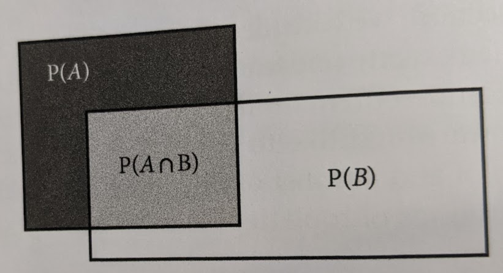

<style>
.forceBreak { -webkit-column-break-after: always; break-after: column; }
</style>

<!-- To render the lecture in Rmarkdown, enter the command below in the R console -->
<!-- rmarkdown::render("lecture16.Rmd") -->

```{r,echo=FALSE}
	#set any global options
	options(digits=3)
	set.seed(123)
```


## Today {.build}

1. Conditional probabilities

2. Homework review

3. Probability distributions

```{r echo=FALSE}
nTots <- 100
brnHair <- rbinom(1, nTots,0.6)
blkHair <- nTots - brnHair
plnShoe <- rbinom(1, nTots,0.8)
sprklShoe <- nTots - plnShoe
brnpln <- round(nTots * (brnHair/nTots * plnShoe/nTots))
brnsprkl <- brnHair - brnpln
hair_shoe <- matrix(c(brnpln,brnsprkl,plnShoe - brnpln,sprklShoe - brnsprkl),nrow=2,ncol=2,byrow=TRUE)
row.names(hair_shoe) <- c("black hair","brown hair")
colnames(hair_shoe) <- c("plain","sparkly")

hair_shoe <- cbind(hair_shoe,rowSums(hair_shoe))
hair_shoe <- rbind(hair_shoe,colSums(hair_shoe))
row.names(hair_shoe)[3] <- "total"
colnames(hair_shoe)[3] <- "total"
```


## Conditional probabilities

- a **_conditional probability_** is the probability of one outcome _conditional_ on another

- written as p(A | B), read as "probability of A _given_ B"

- probability of the intersection of A and B, divided by the probability of B

<div class ="centered">
$\Huge p(A|B) = \frac{p(A ~ \cap ~ B)}{p(B)}$
</div>

## Conditional probabilities

```{r, out.width="500px",echo=FALSE,fig.align="center"}
	
```

<div class ="centered">
$\Huge p(A|B) = \frac{p(A ~ \cap ~ B)}{p(B)}$
</div>

## Conditional probabilities

`r knitr::kable(hair_shoe,align="c")`

\
\
- probability of sparkly shoes **IF** you have black hair?

## Conditional probabilities

`r knitr::kable(hair_shoe,align="c")`

\
\
- probability of sparkly shoes **IF** you have black hair?
\
\
p(A | B) = p(A $\cap$ B)/p(B) =

## Conditional probabilities

`r knitr::kable(hair_shoe,align="c")`

\
\
- probability of sparkly shoes **IF** you have black hair?
\
\
p(A | B) = p(A $\cap$ B)/p(B) = `r hair_shoe[1,2]` / `r hair_shoe[1,3]` = `r hair_shoe[1,2] / hair_shoe[1,3]`


## Conditional probabilities {.build}

- recall that if A and B are independent, p( A $\cap$ B) = p(A) * p(B)

- so if A and B are independent:

<div class ="centered">

$\Large
\begin{aligned}
 p(A \mid B) &= \frac{p(A ~ \cap ~ B)}{p(B)} \\
\\
&= \frac{p(A)p(B)}{p(B)} = p(A)
\end{aligned}$
</div>

## Conditional probabilities {.build}

`r knitr::kable(hair_shoe,align="c")`

\

Does a kid's hair color affect the probability that their parents will get them 
a sweet pair of sparkly shoes?

p(sparkle shoes | black hair) = `r (hair_shoe[1,2]/hair_shoe[1,3])`

p(sparkle shoes) = `r (hair_shoe[3,2]/hair_shoe[3,3])`

## Rules of probability: recap {.build}

1. The probability of an **_outcome_** is the number of times the outcome occurs divided by the total number of trials.

2. The probability of a **_complex event_** is the sum of the probabilities of its constitutive events.

3. The probability of a **_shared event_** is the product of the probabilities of its constitutive events, so long as they're independent.

4. The sum of the probabilities of **_all possible outcomes_** of an event is equal to 1.

5. A **_conditional probability_** is probability of one outcome _conditional_ on another, 
and is equal to the probability of the intersection of the outcomes, 
divided by the probability of the condition

## Today 

1. Conditional probabilities

2. Homework review

3. Probability distributions

## Homework Review - birthday twinsies

**The Birthday Problem** is a classic problem in probability:

how many people must be in a room for there to be > 50% probability 
that _at least_ two of them share a birthday?


## Homework Review - birthday twinsies {.build}

Write a function for simulating the birthday problem. 
The argument of the function should be the number of people in the room, 
and it should return the probability (from simulations), that two or more 
share a birthday.

\

When in doubt, start w/ the pseudocode

## Homework Review - birthday twinsies {.build}


## Homework Review - birthday twinsies

\

```{r,echo=TRUE}

# Write a function with argument N (number of people)

	# draw N birthdays from the year (w/ replacement!)

	# if the total number of birthdays is < N
	#	log as a "bday twinsies" event

# Run this function for each simulation
#	return the proportion of simulations with birthday twinsies
```
\


## My solution {.build}
```{r, echo=TRUE}

# Write a function where you
birthdaySharing <- function(myN){
  # draw N birthdays from the year (w/ replacement!)
  birthdays = sample(1:365, myN, replace=T)
  	# if the total number of birthdays is < N
  if (sum(duplicated(birthdays))>0) { 
    		#	log as a "bday twinsies" event
    myOut = TRUE} else {myOut = FALSE}
  return(myOut)
}

birthdaySim <- function(myP){
# Run the function for each simulation for a given P
myOut = sapply(1:1e5,function(x){birthdaySharing(myP)})
#	return the proportion of simulations with birthday twinsies
  return(sum(myOut)/1e5)}
```

```{r, echo=TRUE, eval=F}
which(sapply(1:30,function(n){birthdaySim(n)}) > 0.5)[1]
```


## Birthday problem - analytical solution

A = two people share a birthday \
A' = no people share a birthday \
N = number of people in the room \
\
\
<div class ="centered">
$\large
\begin{aligned}
p(A) &= 1 - p(A') \\
\\
p(A') &= \frac{365}{365} \times \frac{364}{365} \times \ldots  \times \frac{365-(N-1)}{365}\\
\end{aligned}$
</div>


## Another example: coin-flipping {.build}

Let's say I hand you a quarter and ask you to flip it 3 times 
and count the number of heads that you get.

Working in groups, 
write an R function that uses `sample()` 
to simulate these flips.

## Another example: coin-flipping {.build}


```{r}
flips <- function(nFlips){
	flips <- sample(c(0,1),nFlips,replace=TRUE)
	flips[flips==1] <- "H"
	flips[flips==0] <- "T"
	return(flips)
}

flips(3)

flips(3)
```

## Another example: coin-flipping {.build}

Let's say I hand you a quarter and ask you to flip it 3 times 
and count the number of heads that you get.

- Some questions:
1. What is the probability of the sequence THH?
2. What is the probability I get exactly 2 heads out of 3 flips?
3. What is the probabilty I **_do not_** get exactly 2 heads out of 3 flips?


## Coin-flipping: 3-flip state space {.build}

- First, let's define the **state space** (the list of all possible outcomes)
	+ {HHH, HHT, HTH, THH, TTH, THT, HTT, TTT}

\

1. What is the probability of the sequence THH?
	+ {HHH, HHT, HTH,<span style="color:red">THH</span>, TTH, THT, HTT, TTT} = 1/8
2. What is the probability I get exactly 2 heads out of 3 flips?
	+ {HHH,<span style="color:red">HHT</span>,<span style="color:red">HTH</span>,<span style="color:red">THH</span>, TTH, THT, HTT, TTT} = 3/8
3. What is the probabilty I _do not_ get exactly 2 heads out of 3 flips?
	+ {<span style="color:red">HHH</span>, HHT, HTH, THH,<span style="color:red">TTH</span>,<span style="color:red">THT</span>,<span style="color:red">HTT</span>,<span style="color:red">TTT</span>} = 1 - 3/8 = 5/8

## Coin-flipping: 4-flip state space {.build}

What about if I gave you 4 flips?  What's p(2 heads)?

HHHH, <span style="color:red">THHT</span>, HHTH, <span style="color:red">TTHH</span>, 
<span style="color:red">HTTH</span>, TTHT, <span style="color:red">HHTT</span>, TTTT, \
THHH, HHHT, <span style="color:red">THTH</span>, HTHH, 
TTTH, <span style="color:red">HTHT</span>, THTT, HTTT

p(2 heads) = 6/16 = 3/8
\
\
Clearly, writing out all possible outcomes and colorizing them using CSS notation in Rmarkdown and then counting them will get tedious.

We must generalize!

## Coin-flipping: 4-flip state space {.build}

state space = \
 
HHHH, THHT, HHTH, TTHH, 
HTTH, TTHT, HHTT, TTTT, \
THHH, HHHT, THTH, HTHH, 
TTTH, HTHT, THTT, HTTT


|     Heads    |  Probability  |
|:------------:|:-------------:|
|      0       |     1/16      |
|      1       |     4/16      |
|      2       |     6/16      |
|      3       |     4/16      |
|      4       |     1/16      |

## Coin-flipping: 4-flip state space

state space = \
 
HHHH, THHT, HHTH, TTHH, 
HTTH, TTHT, HHTT, TTTT, \
THHH, HHHT, THTH, HTHH, 
TTTH, HTHT, THTT, HTTT

\
\

This is a distribution of probabilities... \

Can we make a **probability distribution**?

## Probability distributions, random variables {.build}

A **_probability distribution_** is a function that provides 
the probability of each outcome in the sample space.

In doing so, it is implicitly treating the outcome of 
the process (in this case, coin-flipping) as a **_random variable_**.

A **_random variable_** is a variable whose value is the 
outcome of a **_stochastic_** (or random) **_process_**.

## Historical aside {.build}

A random variable is also called an "aleatory variable."  Why?

```{r, out.width="305px",out.height="428px",echo=FALSE,fig.align="center"}
	
```

## Historical aside

A random variable is also called an "aleatory variable."  Why?

```{r, out.width="305px",out.height="428px",echo=FALSE,fig.align="center"}
	
```

## Coin-flipping: a probability distribution {.build}

|     Heads    |  Probability  |
|:------------:|:-------------:|
|      0       |     1/16      |
|      1       |     4/16      |
|      2       |     6/16      |
|      3       |     4/16      |
|      4       |     1/16      |

\

<div class="centered">
$\Huge p(\text{1 head}) < p(\text{2 heads})$
</div>

## Coin-flipping: a probability distribution {.build}

<div class="centered">
$\Huge p(\text{1 head}) < p(\text{2 heads})$
</div>

\

but we know, out of 4 flips:

\

<div class="centered">
$\Huge p(\text{HTTT}) = p(\text{HTHT})$
</div>


\

so what's the deal?

## Coin-flipping: a probability distribution {.build}

<div class="centered">
$p(\text{1 head in 4 flips})$
</div>

HHHH, THHT, HHTH, TTHH, 
HTTH, <span style="color:red">TTHT</span>, HHTT, TTTT, \
THHH, HHHT, THTH, HTHH,
<span style="color:red">TTTH</span>, HTHT, <span style="color:red">THTT</span>, <span style="color:red">HTTT</span>

\

{
<span style="color:red">HTTT</span>,
<span style="color:red">THTT</span>,
<span style="color:red">TTHT</span>,
<span style="color:red">TTTH</span>
} = 4/16

## Coin-flipping: a probability distribution {.build}

<div class="centered">
$p(\text{2 heads in 4 flips})$
</div>

HHHH, <span style="color:red">THHT</span>, HHTH, <span style="color:red">TTHH</span>, 
<span style="color:red">HTTH</span>, TTHT, <span style="color:red">HHTT</span>, TTTT, \
THHH, HHHT, <span style="color:red">THTH</span>, HTHH, 
TTTH, <span style="color:red">HTHT</span>, THTT, HTTT

{
<span style="color:red">HHTT</span>,
<span style="color:red">HTHT</span>,
<span style="color:red">HTTH</span>,
<span style="color:red">THHT</span>
<span style="color:red">THTH</span>
<span style="color:red">TTHH</span>
} = 6/16

\

Because the coin is fair, each **shared event** (comprised of 4 simple events) is equi-probable.  

\

But, there are more _ways_ of realizing the complex event of **(2heads)**!

## Coin-flipping: a probability distribution {.build}

So, we know that our **_probability distribution function_** will have 
two components: 

1. The probability of each **shared event**
2. The number of shared events that give a desired outcome (**complex event**)

\

Let's generalize!

_n_ = number of trials \
_k_ = number of successes \
_p_ = probability of success (for coin flips, we've assumed 1/2) \

## Coin-flipping: a probability distribution {.build}

_n_ = number of trials \
_k_ = number of successes \
_p_ = probability of success (for coin flips, we've assumed 1/2) \

Two components to calculating the probability of _k_ successes: 

Part 1: what's the probability of the **shared event** comprised of _k_ successes and _n_-_k_ failures?

<div class="centered">
$\Large p^k \times (1-p)^{n-k}$
</div>

Part 2: how many permutations of _n_ events give _k_ successes?


## Coin-flipping: a probability distribution {.build}
### how many permutations of _n_ events give _k_ successes?

For four flips, we had the table below: 


|     Heads    |  Probability  |
|:------------:|:-------------:|
|      0       |     1/16      |
|      1       |     4/16      |
|      2       |     6/16      |
|      3       |     4/16      |
|      4       |     1/16      |


## Coin-flipping: a probability distribution

We can calculate for specific values of _n_ and _k_:
```{r,echo=FALSE,fig.height=5.5,fig.width=6.5}
plot(0:4,choose(4,0:4),pch=19,cex=1.5,
	xlab="k",ylab="permutations with k successes",
	main="n=4",ylim=c(0,7))
```

## Coin-flipping: a probability distribution

We can calculate for specific values of _n_ and _k_:
```{r,echo=FALSE,fig.height=5.5,fig.width=6.5}
plot(0:4,choose(4,0:4),pch=19,cex=1.5,xlim=c(0,6),
	xlab="k",ylab="permutations with k successes",ylim=c(0,25))
	points(0:5,choose(5,0:5),pch=19,cex=1.5,col=2)
	points(0:6,choose(6,0:6),pch=19,cex=1.5,col=3)
	legend(x="topright",col=c(1,2,3),pch=19,pt.cex=1.5,
			legend=c("n=4","n=5","n=6"))
```

## Coin-flipping: a probability distribution

We can calculate for specific values of _n_ and _k_:
```{r,echo=FALSE,fig.height=5.5,fig.width=6.5}
plot(0:4,choose(4,0:4),pch=19,cex=1.5,xlim=c(0,8),
	xlab="k",ylab="permutations with k successes",ylim=c(0,75))
	points(0:5,choose(5,0:5),pch=19,cex=1.5,col=2)
	points(0:6,choose(6,0:6),pch=19,cex=1.5,col=3)
	points(0:7,choose(7,0:7),pch=19,cex=1.5,col=4)
	points(0:8,choose(8,0:8),pch=19,cex=1.5,col=6)
	legend(x="topright",col=c(1,2,3,4,6),pch=19,pt.cex=1.5,
			legend=c("n=4","n=5","n=6","n=7","n=8"))
```

## Coin-flipping: a probability distribution
### how many permutations of _n_ events give _k_ successes?

Pascal's Triangle! (See also Halayudha in the 900s CE)

```{r, out.width="705px",out.height="328px",echo=FALSE,fig.align="center"}
	
```

## Coin-flipping: a probability distribution
### how many permutations of _n_ events give _k_ successes?

Binomial coefficient!

```{r, out.width="705px",out.height="328px",echo=FALSE,fig.align="center"}
	
```

## Coin-flipping: a probability distribution
### how many permutations of _n_ events give _k_ successes?

\

<div class="centered">
$\Huge {{n}\choose{k}} = \frac{n!}{k!(n-k)!}$
</div>

\

<div class="centered">
$\large x! = x \times (x-1) \times (x-2) \times \dots \times 1$
</div>

## Coin-flipping: a probability distribution {.build}

_n_ = number of trials \
_k_ = number of successes \
_p_ = probability of success (for coin flips, we've assumed 1/2) \

Two components to calculating the probability of _k_ successes: 

Part 1: what's the probability of the **shared event** comprised of _k_ successes and _n_-_k_ failures?

<div class="centered">
$\Large p^k \times (1-p)^{n-k}$
</div>

Part 2: how many permutations give _k_ successes?

<div class="centered">
$\Large {{n}\choose{k}} = \frac{n!}{k!(n-k)!}$
</div>

## Coin-flipping: probability distribution function {.build}

_n_ trials \
_k_ successes \
_p_ probability of success \
\

<div class="centered">
$\Large {{n}\choose{k}}p^k (1-p)^{n-k}$
</div>

\

Work in groups to write a function that returns 
the probability of a number of heads (_k_) given a probability of 
flipping heads (_p_) and a number of flips (_n_).

Hint - check out the function `choose()`.


## Coin-flipping: probability distribution function

_n_ trials \
_k_ successes \
_p_ probability of success \
\

<div class="centered">
$\Large {{n}\choose{k}}p^k (1-p)^{n-k}$
</div>

\
```{r}
	coin.flip.prob <- function(n,k,p){
		prob <- choose(n,k) * p^k * (1-p)^(n-k)
		return(prob)
	}
```


## Coin-flipping: probability distribution function {.build}

```{r,fig.width=6.5,fig.height=5.5,fig.align="center",echo=FALSE}
	par(oma=c(3,0,0,0))
	plot(coin.flip.prob(n=100,k=0:100,p=0.5),
			xlab="successes",ylab="probability",
			pch=20,col=adjustcolor(1,0.7))
```

## {.build}

<div class="centered">
```{r binomial_animation,fig.show="animate",fig.width=6.5,fig.height=5.5,interval=0.5,cache=TRUE,echo=FALSE}
	for(i in 1:20){
		plot(1:100,coin.flip.prob(n=100,1:100,i/20),
			xlab="",ylab="probability",main="Probability of k successes over values of p",
			pch=20,col=adjustcolor(1,0.7),ylim=c(0,0.16)) ; 
		TeachingDemos::subplot(fun = {
						plot(0,xlim=c(0,1),ylim=c(0,1),xlab="",ylab="",main="",type='n',xaxt='n',yaxt='n')
							mtext(side=3,text="value of p",font=2)
							axis(side=1,at=c(0,0.5,1),labels=c(0,0.5,1))
							axis(side=2,at=c(0,0.5,1),labels=c(0,0.5,1))
							abline(0,1,col=2)
							points(i/20,i/20)
						},
						x=c(35,65),y=c(0.11,0.15))
	}
```
</div>

## Intro to random variables: recap

1. The outcome of a random process is called a **_random variable_**

2. To calculate the probability of any given value of the random variable:
	+ we can either define the state space and count or
	+ we can figure out the probability distribution function

3. A **_probability distribution function_** is a rule or formula 
that describes the probability of all possible outcomes of a random event

4. Julius Caesar began the Great Roman Civil War in 49 BCE when he crossed 
the Rubicon against the express orders of the Senate, 
apocryphally uttering the phrase, _"alea iacta est"_