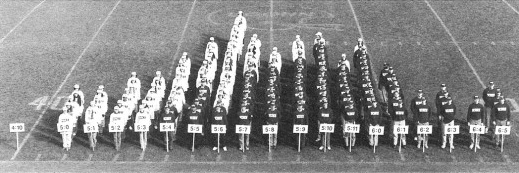
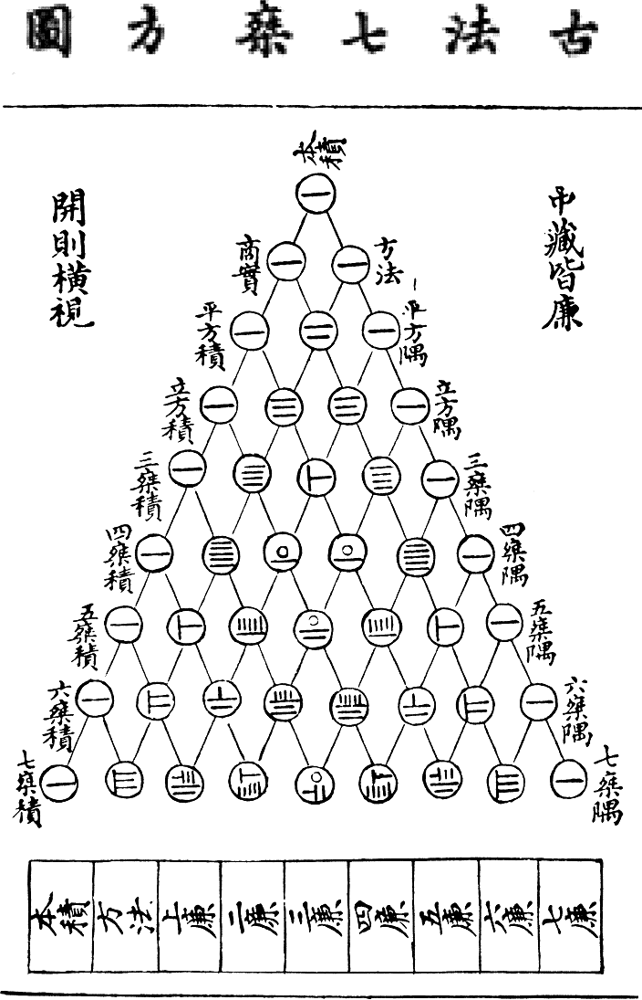
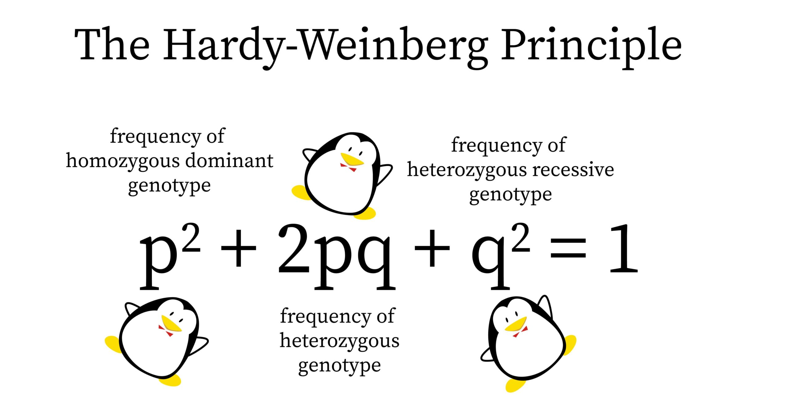

<!-- To render the lecture in Rmarkdown, enter the command below in the R console -->
<!-- rmarkdown::render("lecture17.Rmd") -->

```{r,echo=FALSE}
	#set any global options
	options(digits=3)
	set.seed(123)
```


```{r, eval=F, echo=F}
flips <- function(nFlips){
	flips <- sample(c('H','T'), nFlips, replace=TRUE)
	return(flips)
}

flips(3)

#mySims = replicate(100, flips(3), simplify=TRUE)
```

## Today: Probability distributions!

What if the probability of different outcomes varies?

How do we describe this situation?

## Motivating examples {.build}

Pick a random person in the room. What is the probability that they are 5'5"?

```{r, out.width="500px",echo=FALSE,fig.align="center"}
	
```

## Motivating examples {.build}

If I flip a coin 100 times, what is the probability that I'll get 51 heads and 49 tails?


## Coin-flipping {.build}

Let's say I hand you a quarter and ask you to flip it 3 times 
and count the number of heads that you get.

- This is the **state space** (the list of all possible outcomes)
	+ {HHH, HHT, HTH, THH, TTH, THT, HTT, TTT}

- Some questions to answer in your teams:

1. What is the probability of the sequence THH?
2. What is the probability I get exactly 2 heads out of 3 flips?
3. What is the probabilty I **_do not_** get exactly 2 heads out of 3 flips?


## Coin-flipping: 3-flip state space {.build}

{HHH, HHT, HTH, THH, TTH, THT, HTT, TTT}

1. What is the probability of the sequence THH?
	+ {HHH, HHT, HTH,<span style="color:red">THH</span>, TTH, THT, HTT, TTT} = 1/8
2. What is the probability I get exactly 2 heads out of 3 flips?
	+ {HHH,<span style="color:red">HHT</span>,<span style="color:red">HTH</span>,<span style="color:red">THH</span>, TTH, THT, HTT, TTT} = 3/8
3. What is the probabilty I _do not_ get exactly 2 heads out of 3 flips?
	+ {<span style="color:red">HHH</span>, HHT, HTH, THH,<span style="color:red">TTH</span>,<span style="color:red">THT</span>,<span style="color:red">HTT</span>,<span style="color:red">TTT</span>} = 1 - 3/8 = 5/8

## Coin-flipping: 4-flip state space {.build}

What about if I gave you 4 flips?  What's p(2 heads)?

HHHH, <span style="color:red">THHT</span>, HHTH, <span style="color:red">TTHH</span>, 
<span style="color:red">HTTH</span>, TTHT, <span style="color:red">HHTT</span>, TTTT, \
THHH, HHHT, <span style="color:red">THTH</span>, HTHH, 
TTTH, <span style="color:red">HTHT</span>, THTT, HTTT

p(2 heads) = 6/16 = 3/8
\
\
Clearly, writing out all possible outcomes and colorizing in Rmarkdown and then counting them will get tedious.

Let's make a table

## Coin-flipping: 4-flip state space {.build}

state space = \
 
HHHH, THHT, HHTH, TTHH, 
HTTH, TTHT, HHTT, TTTT, \
THHH, HHHT, THTH, HTHH, 
TTTH, HTHT, THTT, HTTT


|     Heads    |  Probability  |
|:------------:|:-------------:|
|      0       |     1/16      |
|      1       |     4/16      |
|      2       |     6/16      |
|      3       |     4/16      |
|      4       |     1/16      |

## Coin-flipping: 4-flip state space

state space = \
 
HHHH, THHT, HHTH, TTHH, 
HTTH, TTHT, HHTT, TTTT, \
THHH, HHHT, THTH, HTHH, 
TTTH, HTHT, THTT, HTTT

\
\

This is a distribution of probabilities... \

Can we make a **probability distribution**?

## Probability distributions, random variables {.build}

A **_probability distribution_** is a function that provides 
the probability of each outcome in the sample space.

In doing so, it is implicitly treating the outcome of 
the process (in this case, coin-flipping) as a **_random variable_**.

A **_random variable_** is a variable whose value is the 
outcome of a **_stochastic_** (or random) **_process_**.

## Coin-flipping: a probability distribution {.build}

|     Heads    |  Probability  |
|:------------:|:-------------:|
|      0       |     1/16      |
|      1       |     4/16      |
|      2       |     6/16      |
|      3       |     4/16      |
|      4       |     1/16      |

\

<div class="centered">
$\ p(\text{1 head}) < p(\text{2 heads})$
</div>

## Coin-flipping: a probability distribution {.build}

<div class="centered">
$\ p(\text{1 head}) < p(\text{2 heads})$
</div>

\

but we know, out of 4 flips:

\

<div class="centered">
$\ p(\text{HTTT}) = p(\text{HTHT})$
</div>


\

so what's the deal?

## Coin-flipping: a probability distribution {.build}

<div class="centered">
$p(\text{1 head in 4 flips})$
</div>

HHHH, THHT, HHTH, TTHH, 
HTTH, <span style="color:red">TTHT</span>, HHTT, TTTT, \
THHH, HHHT, THTH, HTHH,
<span style="color:red">TTTH</span>, HTHT, <span style="color:red">THTT</span>, <span style="color:red">HTTT</span>

\

{
<span style="color:red">HTTT</span>,
<span style="color:red">THTT</span>,
<span style="color:red">TTHT</span>,
<span style="color:red">TTTH</span>
} = 4/16

## Coin-flipping: a probability distribution {.build}

<div class="centered">
$p(\text{2 heads in 4 flips})$
</div>

HHHH, <span style="color:red">THHT</span>, HHTH, <span style="color:red">TTHH</span>, 
<span style="color:red">HTTH</span>, TTHT, <span style="color:red">HHTT</span>, TTTT, \
THHH, HHHT, <span style="color:red">THTH</span>, HTHH, 
TTTH, <span style="color:red">HTHT</span>, THTT, HTTT

{
<span style="color:red">HHTT</span>,
<span style="color:red">HTHT</span>,
<span style="color:red">HTTH</span>,
<span style="color:red">THHT</span>
<span style="color:red">THTH</span>
<span style="color:red">TTHH</span>
} = 6/16

\

Because the coin is fair, each **shared event** (comprised of 4 simple events) is equi-probable.  

\

But, there are more _ways_ of realizing the complex event of **(2heads)**!

## Coin-flipping: a probability distribution {.build}

So, we know that our **_probability distribution function_** will have 
two components: 

1. The probability of each **shared event**
2. The number of shared events that give a desired outcome (**complex event**)

\

Let's generalize for more flips!

_n_ = number of trials \
_k_ = number of successes \
_p_ = probability of heads (assume 1/2) \

## Coin-flipping: a probability distribution {.build}


_n_ = number of flips \
_k_ = number of heads \
_p_ = probability of heads (assume 1/2) \

Two components to calculating the probability of _k_ successes: 

Part 1: what's the probability of the **shared event** comprised of a specific sequence of heads and tails??

<div class="centered">
$\Large (1/2)^{n}$
</div>

Part 2: how many permutations of _n_ events give _k_ heads?


## Coin-flipping: a probability distribution {.build}
### how many permutations of _n_ events give _k_ successes?

For four flips, we had the table below: 


|     Heads    |  Probability  |
|:------------:|:-------------:|
|      0       |     1/16      |
|      1       |     4/16      |
|      2       |     6/16      |
|      3       |     4/16      |
|      4       |     1/16      |


## Coin-flipping: a probability distribution

We can calculate for specific values of _n_ and _k_:
```{r,echo=FALSE,fig.height=5.5,fig.width=6.5}
plot(0:4,choose(4,0:4),pch=19,cex=1.5,
	xlab="k",ylab="permutations with k successes",
	main="n=4",ylim=c(0,7))
```

## Coin-flipping: a probability distribution

We can calculate for specific values of _n_ and _k_:
```{r,echo=FALSE,fig.height=5.5,fig.width=6.5}
plot(0:4,choose(4,0:4),pch=19,cex=1.5,xlim=c(0,6),
	xlab="k",ylab="permutations with k successes",ylim=c(0,25))
	points(0:5,choose(5,0:5),pch=19,cex=1.5,col=2)
	points(0:6,choose(6,0:6),pch=19,cex=1.5,col=3)
	legend(x="topright",col=c(1,2,3),pch=19,pt.cex=1.5,
			legend=c("n=4","n=5","n=6"))
```

## Coin-flipping: a probability distribution

We can calculate for specific values of _n_ and _k_:
```{r,echo=FALSE,fig.height=5.5,fig.width=6.5}
plot(0:4,choose(4,0:4),pch=19,cex=1.5,xlim=c(0,8),
	xlab="k",ylab="permutations with k successes",ylim=c(0,75))
	points(0:5,choose(5,0:5),pch=19,cex=1.5,col=2)
	points(0:6,choose(6,0:6),pch=19,cex=1.5,col=3)
	points(0:7,choose(7,0:7),pch=19,cex=1.5,col=4)
	points(0:8,choose(8,0:8),pch=19,cex=1.5,col=6)
	legend(x="topright",col=c(1,2,3,4,6),pch=19,pt.cex=1.5,
			legend=c("n=4","n=5","n=6","n=7","n=8"))
```

## Coin-flipping: a probability distribution
### how many permutations of _n_ events give _k_ successes?

Pascal's Triangle!

```{r, out.width="705px",out.height="328px",echo=FALSE,fig.align="center"}
	
```

## Coin-flipping: a probability distribution

```{r, out.width="600px",echo=FALSE,fig.align="center"}
	knitr::include_graphics("figs/PascalTriangleAnimated2.gif")
```

## Not just Pascal's triangle
Khayyam's triangle (Persia, 1100s)

Yang Hui's triangle (China, 1200s)

Tartaglia's triangle (Italy, 1500s)

Pascal's triangle (France, 1600s)

## Yang Hui's triangle
```{r, out.width="300px",echo=FALSE,fig.align="center"}
	
```


## Coin-flipping: a probability distribution
### how many permutations of _n_ events give _k_ successes?

Binomial coefficient!

```{r, out.width="705px",out.height="328px",echo=FALSE,fig.align="center"}
	
```

## Coin-flipping: a probability distribution
### how many permutations of _n_ events give _k_ successes?

\

<div class="centered">
$\Huge {{n}\choose{k}} = \frac{n!}{k!(n-k)!}$
</div>

\

<div class="centered">
$\large x! = x \times (x-1) \times (x-2) \times \dots \times 1$
</div>

## Coin-flipping: a probability distribution {.build}

_n_ = number of flips \
_k_ = number of heads
_p_ = probability of heads (assume 1/2) \

Two components to calculating the probability of _k_ successes: 

Part 1: what's the probability of each **shared event**

<div class="centered">
$\Large (1/2)^{n}$
</div>

Part 2: how many permutations give _k_ successes?

<div class="centered">
$\Large {{n}\choose{k}} = \frac{n!}{k!(n-k)!}$
</div>

## Coin-flipping: probability distribution function

_n_ trials, _k_ successes, 1/2 probability of success \

<div class="centered">
$\ {{n}\choose{k}}(1/2)^{n}$
</div>

\

Work in groups to write a function that returns 
the probability of a number of heads (_k_) given a probability of 
flipping heads of 1/2 and a number of flips (_n_).

Hint - check out the function `choose()`

Make a plot with 1 to 100 on the x axis, and the y axis shows your probability of x heads if you flip a coin 100 times.

## Coin-flipping: probability distribution function

_n_ trials, _k_ successes, 1/2 probability of success \


<div class="centered">
$\ {{n}\choose{k}}(1/2)^{n}$
</div>

\
```{r}
	coin.flip.prob <- function(n,k){
		prob <- choose(n,k) * (1/2)^n
		return(prob)
	}
```

## Coin-flipping: probability distribution function {.build}

```{r,fig.width=6.5,fig.height=5.5,fig.align="center",echo=TRUE, eval=F}
	par(oma=c(3,0,0,0))
	plot(coin.flip.prob(n=100,k=0:100),
			xlab="heads",ylab="probability",
			pch=20,col=adjustcolor(1,0.7))
```


## Coin-flipping: probability distribution function {.build}

```{r,fig.width=6.5,fig.height=5.5,fig.align="center",echo=FALSE}
	par(oma=c(3,0,0,0))
	plot(coin.flip.prob(n=100,k=0:100),
			xlab="heads",ylab="probability",
			pch=20,col=adjustcolor(1,0.7))
```

## Coin-flipping: probability distribution function {.build}
What if we change p?

If p(heads) = 0.1 and you flip a coin 3 times,

p(HHH) = ?\
p(TTT) = ?\
p(THH) = ?\

## Coin-flipping: probability distribution function {.build}
If p(heads) = 0.1 and you flip a coin 3 times,

p(HHH) = $(0.1)^{3}$ = 0.001\
p(TTT) = $(0.9)^{3}$ =0.729\
p(THH) = $(0.9)^{1} \times (0.1)^{2}$ = 0.009\   

## Generalizing for different values of p

_n_ = number of trials \
_k_ = number of successes \
_p_ = probability of success (for coin flips, assume 1/2) \

Two components to calculating the probability of _k_ successes: 

Part 1: what's the probability of the **shared event** comprised of _k_ successes and _n_-_k_ failures?

<div class="centered">
$\Large p^k \times (1-p)^{n-k}$
</div>

Part 2: 
<div class="centered">
$\ {{n}\choose{k}}$
</div>

## The binomial distribution!!!

<div class="centered">
$\Large {{n}\choose{k}} p^k \times (1-p)^{n-k}$

</div>

## Write a function!
Work in your teams to edit your function from before to account for variable values of p.

## Write a function

\
```{r}
	coin.flip.prob <- function(n,k,p){
		prob <- choose(n,k) * p^k * (1-p)^(n-k)
		return(prob)
	}
```


## {.build}

<div class="centered">
```{r binomial_animation,fig.show="animate",fig.width=6.5,fig.height=5.5,interval=0.5,cache=TRUE,echo=FALSE}
	for(i in 1:20){
		plot(1:100,coin.flip.prob(n=100,1:100,i/20),
			xlab="",ylab="probability",main="Probability of k successes over values of p",
			pch=20,col=adjustcolor(1,0.7),ylim=c(0,0.16)) ; 
		TeachingDemos::subplot(fun = {
						plot(0,xlim=c(0,1),ylim=c(0,1),xlab="",ylab="",main="",type='n',xaxt='n',yaxt='n')
							mtext(side=3,text="value of p",font=2)
							axis(side=1,at=c(0,0.5,1),labels=c(0,0.5,1))
							axis(side=2,at=c(0,0.5,1),labels=c(0,0.5,1))
							abline(0,1,col=2)
							points(i/20,i/20)
						},
						x=c(35,65),y=c(0.11,0.15))
	}
```
</div>

## Some real science examples: Genetics

```{r, out.width="500px",echo=FALSE,fig.align="center"}
	
```


## Hardy Weinberg Equilibirum {.build}

If the frequency of an allele *A* is $p$ and the frequence of the allele *a* is $1-p$, assuming HWE, what is the frequency of the *AA* genotype?

Why is it $p^2$?

In probability land: $f(AA) = f(A) \times f(A) = p^2$

## Hardy Weinberg Equilibirum {.build}

Can we use the binomial distribution to understand why $f(AA) = p^2$?

Number of trials (N)?

2

Number of successes (K)?

2

$p(AA) = {{n}\choose{k}} p^k \times (1-p)^{n-k} = {{2}\choose{2}} p^2 \times (1-p)^{2-2} = p^2$

## Some real life science examples: plant diversity {.build}

In 1964, Erlich and Raven proposed that plant chemical defenses against attack by herbivores would spur plant diversification. In a test of this idea (Farrell et al. 1991), the number of species in 16 pairs of sister clades whose species differed in their level of chemical protection were counted. In each pair of sister clades, the plants of one clade were defended by a gooey latex or resin that was exuded when the leaf was damaged, whereas the plants of the other clade lacked this defense. In 13 of the 16 pairs, the clade with latex/resin was found to be the more diverse (had more species), whereas in the other three pairs, the sister clade lacking latex/resin was found to be the not more diverse.

## Plant diversity and latex {.build}

What is the probability of seeing 13 pairs where the clade with latex is more diverse than the other clade, if there is no association betwen latex and diversity (so p = 0.5)?

$p = {{n}\choose{k}} p^k \times (1-p)^{n-k}$

$= {{16}\choose{13}} (0.5)^2 \times (1-0.5)^{16-13}$

```{r}
coin.flip.prob(n=16, k=13, p=0.5)
```

How would we get from this probability to a p value?

## Recap

1. The outcome of a random process is called a **_random variable_**

2. To calculate the probability of any given value of the random variable:
	+ we can either define the state space and count or
	+ we can figure out the probability distribution function

3. A **_probability distribution function_** is a rule or formula 
that describes the probability of all possible outcomes of a random event

4. The **_binomial distribution_** describes the probabilities of success in a set of trials.
