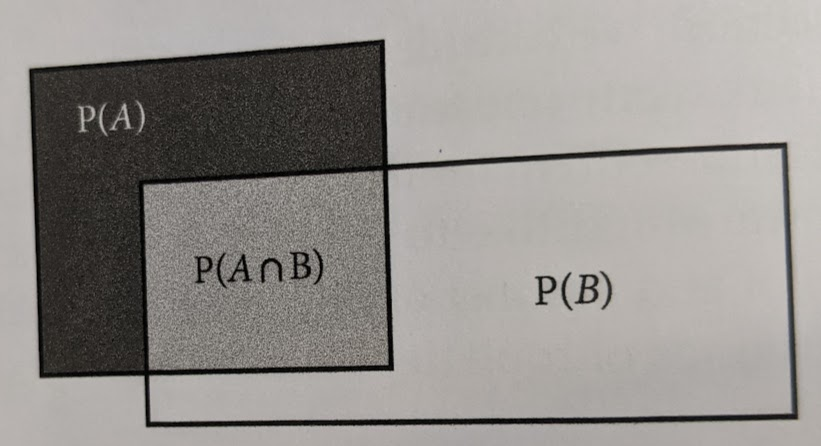

<!-- To render the lecture in Rmarkdown, enter the command below in the R console -->
<!-- rmarkdown::render("lecture20.Rmd") -->

```{r, include=FALSE}
	set.seed(234)
	options(digits=5)
```

## The Law of Large Numbers {.build}

$X \sim B(n=100, p=0.3)$

```{r,echo=FALSE}
par(mfrow=c(1,2))
	x1 <- rbinom(5,size=100,prob=0.3)
	x2 <- rbinom(5e6,size=100,prob=0.3)
		hist(x1,col="slateblue",main=sprintf("5 samples\nE[X] - mean(X) = %s",signif(30-mean(x1),3)),xlim=c(0,100))
			abline(v=mean(x1),col="red",lwd=2)
			abline(v=100*0.3,col="green",lwd=2)
		hist(x2,col="slateblue",main=sprintf("5e6 samples\nE[X] - mean(X) = %s",signif(30-mean(x2),3)),xlim=c(0,100))
			abline(v=mean(x2),col="red",lwd=2)
			abline(v=100*0.3,col="green",lwd=2)
		legend(x="topright",lty=1,col=c("red","green"),legend=c("sample mean","expectation"),cex=0.7)
```

## The Law of Large Numbers {.build}

As the number of samples increases, the sample average converges on the 
expected value.

Discovered by our friend Jacob/James/Jaccques Bernoulli!

## Visualizing the Law of Large Numbers

```{r,echo=TRUE,eval=F}
	draw.running.mean <- function(r,n){
		replicate(r,{
			x1 <- rnorm(n,mean=0,sd=0.5)
			x1.mean <- cumsum(x1)/(1:n)
			lines(1:n,x1.mean,col=adjustcolor(1,0.2))
		})
		return(invisible(0))
	}
	n <- 1e2
	plot(0,xlim=c(0,n),ylim=c(-0.5,0.5),type='n',
			xlab="number of draws from a normal",
			ylab="running mean")
		draw.running.mean(r = 1,n = 100)
		abline(h=0,col=2)
```

## Visualizing the Law of Large Numbers

```{r,echo=F,eval=T, cache=T}
	draw.running.mean <- function(r,n){
		replicate(r,{
			x1 <- rnorm(n,mean=0,sd=0.5)
			x1.mean <- cumsum(x1)/(1:n)
			lines(1:n,x1.mean,col=adjustcolor(1,0.2))
		})
		return(invisible(0))
	}
	n <- 1e2
	plot(0,xlim=c(0,n),ylim=c(-0.5,0.5),type='n',
			xlab="number of draws from a normal",
			ylab="running mean")
		draw.running.mean(r = 1,n = 100)
		abline(h=0,col=2)
```


## Visualizing the Law of Large Numbers

```{r,echo=FALSE,cache=TRUE}
	n <- 1e2
	plot(0,xlim=c(0,n),ylim=c(-0.5,0.5),type='n',
			xlab="number of draws from a normal",
			ylab="running mean")
		draw.running.mean(r = 1,n = 100)
		abline(h=0,col=2)
```


## Visualizing the Law of Large Numbers

```{r,echo=FALSE,cache=TRUE}

	n <- 1e2
	plot(0,xlim=c(0,n),ylim=c(-0.5,0.5),type='n',
			xlab="number of draws from a normal",
			ylab="running mean")
		draw.running.mean(r = 100,n = n)
		abline(h=0,col=2)
```


## The law of large numbers in population genetics

This is why genetic drift is stronger in small populations!!

https://cjbattey.shinyapps.io/driftR/


## Bird's-eye view {.build}

Step 7: say something _quantitative_ and _objective_ about 
the effect of a predictor on a response.

Step 6: run model (use likelihood-based 
inference and an algorithm to estimate values of parameters of the model)

Step 5: build model (make choices about how we think our data are distributed 
and the nature of the relationship between predictor and response)

Step 4: know about prob. distributions and deterministic functions 

Step 3: understand the concept of likelihood

Step 2: understand the rules of probability

Step 1: be able to do stuff in R


## Bird's-eye view

Step 7: say something _quantitative_ and _objective_ about 
the effect of a predictor on a response.

Step 6: run model (use likelihood-based 
inference and an algorithm to estimate values of parameters of the model)

Step 5: build **Bayesian** model (make choices about how we think our data are distributed 
and the nature of the relationship between predictor and response)

Step 4: know about prob. distributions and deterministic functions 

Step 3: understand the concept of likelihood

Step 2: understand the rules of probability

Step 1: be able to do stuff in R


## Bird's-eye view

Step 7: say something _quantitative_ and _objective_ about 
the effect of a predictor on a response.

Step 6: run model (use likelihood-based 
inference and an algorithm to estimate values of parameters of the model)

Step 5: build **Bayesian** model (make choices about how we think our data are distributed 
and the nature of the relationship between predictor and response)

Step 4: know about prob. distributions and deterministic functions 

Step 3.5: **learn about Bayes Theorem**

Step 3: understand the concept of likelihood

Step 2: understand the rules of probability

## What is Bayes theorem?
```{r, out.width="500px",echo=FALSE,fig.align="center"}
	
```

## Recap of conditional probabilities
- a **_conditional probability_** is the probability of one outcome _conditional_ on another

- written as p(A | B), read as "probability of A _given_ B"

- probability of the intersection of A and B, divided by the probability of B

<div class ="centered">
$\Huge p(A|B) = \frac{p(A ~ \cap ~ B)}{p(B)}$
</div>

## Recap of conditional probabilities

```{r, out.width="500px",echo=FALSE,fig.align="center"}
	
```

<div class ="centered">
$\Huge p(A|B) = \frac{p(A ~ \cap ~ B)}{p(B)}$
</div>

## Conditional probability cont

Say we have a hypothesis $H$ that the probability that a given coin flips heads is 0.5.

And we have observed data $D$ of a large number of flips from that coin.

If we know the probability of data given a hypothesis,
can we calculate the probability of a hypothesis given the data?

$p(D|H)$ -> $p(H|D)$

## Deriving Bayes Theorem {.build}

$p(H \mid D) = \frac{P(D \  \cap \ H)}{P(D)}$ and $p(D \mid H) = \frac{P(H \  \cap \ D)}{P(H)}$ 

$p(H \mid D) = \frac{P(D \  \cap \ H)}{P(D)}$ and $P(H \  \cap \ D) = p(D \mid H) \times P(H)$ 


<div class="centered">
$\Huge{p(H \mid D) = \frac{P(D \  \mid \ H) \times P(H)}{P(D)}}$
</div>

## Bayes Theorem {.build}

<div class="centered">
$\Huge{p(H \mid D) = \frac{P(D \  \mid \ H) \times P(H)}{P(D)}}$
</div>

Bayes Theorem allows us to assess the probability of a hypothesis given some data, 
rather than the other way around, 
as in frequentist statistics.


## Bayes Theorem {.build}

<div class="centered">
$\large{p(H \mid D) = \frac{P(D \  \mid \ H) \times P(H)}{P(D)}}$
</div>

$p(H \; \mid \; D)$ is the _posterior probability_ 

$p(D \; \mid \; H)$ is the _likelihood_ of $D$ given $H$

$p(H)$ is the _prior probability_ of $H$

$p(D)$ is the _marginal likelihood_ or _model evidence_ of D

## Probability problem {.build}

```{r,echo=FALSE}
pr.hepatitis <- 0.001
pr.false.pos <- 0.05
sensitivity <- 0.99
n.people <- 1e6
```

- The proportion of people that develop hepatitis C is `r pr.hepatitis`.

- The probability that a test correctly identifies someone with hepatitis as having hepatitis is `r sensitivity`.

- If someone doesn't have hepatitis, they will test negative for the disease with probability `r 1- pr.false.pos`.

**What is the probability that a person with a positive result actually has hepatitis?**

## Probability problem {.build}

```{r, out.width="700px",echo=FALSE,fig.align="center"}
	
```


## Bayes Theorem - Example {.build}

${p(H \mid D) = \frac{P(D \  \mid \ H) \times P(H)}{P(D)}}$

What's H, and what's D?

"H" is hepatitis, and "D" is the positive result.

\
\

$p(\text{hepatitis} \; \mid \; \text{PosRes}) = \frac{p(\text{PosRes} \; \mid \; \text{hepatitis}) \; \times \; p(\text{hepatitis})}{p(\text{PosRes})}$


## Bayes Theorem - Example {.build}
$p(\text{hepatitis} \; \mid \; \text{PosRes}) = \frac{p(\text{PosRes} \; \mid \; \text{hepatitis}) \; \times \; p(\text{hepatitis})}{p(\text{PosRes})}$

$p(\text{PosRes} \; \mid \; \text{hepatitis}) =$

$p(\text{hepatitis}) =$

$p(\text{PosRes}) =$


## Bayes Theorem - Example
$p(\text{hepatitis} \; \mid \; \text{PosRes}) = \frac{p(\text{PosRes} \; \mid \; \text{hepatitis}) \; \times \; p(\text{hepatitis})}{p(\text{PosRes})}$

$p(\text{PosRes} \; \mid \; \text{hepatitis}) =$ test sensitivity (`r sensitivity`)

$p(\text{hepatitis}) =$ hepatitis frequency (`r pr.hepatitis`)

$p(\text{PosRes}) =$ ???
	
## Bayes Theorem - Example {.build}

What about $p(\text{PosRes})$?

We can break all positive results down into positive results where one has hepatitis, and positive results where one doesn't have hepatitis.

$\begin{aligned}
p(\text{PosRes}) = \: &p(\text{hepatitis}) \times p(\text{PosRes} \mid \text{hepatitis}) \\
&+ p(\text{nohepatitis}) \times p(\text{PosRes} \mid \text{nohepatitis})
\end{aligned}$

$p(\text{PosRes}) =$ `r pr.hepatitis` $\times$ `r sensitivity` $+$ `r 1-pr.hepatitis` $\times$ `r pr.false.pos`

$p(\text{PosRes}) =$ `r pr.hepatitis*sensitivity + (1-pr.hepatitis)*pr.false.pos`

## Bayes Theorem - Example

$p(\text{hepatitis} \; \mid \; \text{PosRes}) = \frac{p(\text{PosRes} \; \mid \; \text{hepatitis}) \; \times \; p(\text{hepatitis})}{p(\text{PosRes})}$

$p(\text{PosRes} \; \mid \; \text{hepatitis}) =$ `r sensitivity`

$p(\text{hepatitis}) =$ `r pr.hepatitis`

$p(\text{nohepatitis}) =$ `r 1 - pr.hepatitis`

$p(\text{PosRes} \mid \text{nohepatitis}) =$ `r pr.false.pos`

$p(\text{PosRes}) =$ `r pr.hepatitis * sensitivity + (1-pr.hepatitis) * pr.false.pos`


## Bayes Theorem - Example

$p(\text{hepatitis} \; \mid \; \text{PosRes}) = \frac{`r (sensitivity * pr.hepatitis)`}{`r (pr.hepatitis * sensitivity + (1-pr.hepatitis) * pr.false.pos)`}$

$p(\text{PosRes} \; \mid \; \text{hepatitis}) =$ `r sensitivity`

$p(\text{hepatitis}) =$ `r pr.hepatitis`

$p(\text{nohepatitis}) =$ `r 1 - pr.hepatitis`

$p(\text{PosRes} \mid \text{nohepatitis}) =$ `r pr.false.pos`

$p(\text{PosRes}) =$ `r pr.hepatitis * sensitivity + (1-pr.hepatitis) * pr.false.pos`

## Bayes Theorem - Example
$p(\text{hepatitis} \; \mid \; \text{PosRes}) = \frac{`r (sensitivity * pr.hepatitis)`}{`r (pr.hepatitis * sensitivity + (1-pr.hepatitis) * pr.false.pos)`}$ = `r (sensitivity*pr.hepatitis)/(pr.hepatitis*sensitivity + (1-pr.hepatitis)*pr.false.pos)`

$p(\text{PosRes} \; \mid \; \text{hepatitis}) =$ `r sensitivity`

$p(\text{hepatitis}) =$ `r pr.hepatitis`

$p(\text{nohepatitis}) =$ `r 1 - pr.hepatitis`

$p(\text{PosRes} \mid \text{nohepatitis}) =$ `r pr.false.pos`

$p(\text{PosRes}) =$ `r pr.hepatitis * sensitivity + (1-pr.hepatitis) * pr.false.pos`


## Bayes'd & Confused {.build}

What's going on here?

We know the false positive rate is only `r pr.false.pos`, 
so if a person gets a "positive" diagnosis, 
shouldn't there be a `r 1 - pr.false.pos` that they have hepatitis?

Yes, but think about the numbers!

## Bayes'd & Confused {.build}

```{r, out.width="500px",echo=FALSE,fig.align="center"}
	
```


## Bayes Theorem - Goats and Doors {.build}

I'm a game show host, and you're a contestant!

**The game:**

There are 3 doors. One hides $1,000,000, and there are goats behind the other two doors.

**for the purposes of the game, we assume goats are not a pet that we'd be delighted to welcome into the family.**

## Bayes Theorem - Goats and Doors

I'm a game show host, and you're a contestant!

**The game:**

There are 3 doors. One hides $1,000,000, and there are goats behind the other two doors.

**The rules:**

 - You guess a door, then I open one of the _other two doors_, and I _never reveal the money_.

 - After I open the door, I ask whether you want to switch your guess to the _other_ door.

 - **Should you switch your guess?!** 

## Goats & Doors (Monty Hall)

```{r,echo=FALSE}
	monty.hall.sim <- function(switch=FALSE){
		money.door <- sample(1:3,1)
		my.guess1 <- sample(1:3,1)
		if(my.guess1 != money.door){
			host.opens <- c(1:3)[-unique(c(money.door,my.guess1))]
		} else {
			host.opens <- sample(c(1:3)[-unique(c(money.door,my.guess1))],1)
		}
		my.guess2 <- ifelse(switch,
							c(1:3)[-unique(c(my.guess1,host.opens))],
							my.guess1)
		results <- list(list("switch" = switch,
						"doors" = list("money.door" = money.door,
									   "my.guess1" = my.guess1,
									   "host.opens" = host.opens,
									   "my.guess2" = my.guess2),
						"win" = ifelse(my.guess2 == money.door,
									   TRUE,
									   FALSE)))
		return(results)
	}

	plot.monty.hall <- function(results){
		doors <- matrix(c(1,3,5,1.5,1.5,1.5),nrow=3,ncol=2)
		lapply(results,
			function(r){
				plot(0,xlim=c(0,6),ylim=c(0,3),xaxt='n',yaxt='n',xlab="",ylab="",type='n',main=paste0("Switch=",r$switch))
					rect(c(0.5,2.5,4.5),c(0.5,0.5,0.5),c(1.5,3.5,5.5),c(2.5,2.5,2.5),col="brown")
					points(c(1.3,3.3,5.3),c(1.5,1.5,1.5),pch=19,cex=2)
					text(x=doors[r$doors$money.door,1],y=doors[r$doors$money.door,2],labels="$",cex=5,col=ifelse(r$win,"green","red"))
					text(x=doors[r$doors$my.guess1,1],y=doors[r$doors$my.guess1,2]+1.2,labels="guess1",cex=3,col="orange")
					text(x=doors[r$doors$host.opens,1],y=doors[r$doors$host.opens,2]+1.2,labels="opens",cex=3,col="orange")
					if(r$switch){
						text(x=doors[r$doors$my.guess2,1],y=doors[r$doors$my.guess2,2]+1.2,labels="guess2",cex=3,col="orange")			
					}
				if(r$win){
					box(lwd=3,col="green")
				} else {
					box(lwd=3,col="red")		
				}
		})
		return(invisible(""))
	}
```

## Goats & Doors (Monty Hall)

```{r,echo=FALSE}
	set.seed(123)
	plot.monty.hall(monty.hall.sim(switch=FALSE))
```

```{r,cache=TRUE}
	noswitch.results <- replicate(400,monty.hall.sim(switch=FALSE))
```

## Goats & Doors (Monty Hall)
```{r,echo=FALSE}
	set.seed(123)
	plot.monty.hall(monty.hall.sim(switch=TRUE))
```

```{r,cache=TRUE}
	switch.results <- replicate(400,monty.hall.sim(switch=TRUE))
```

## No switch p(win):  `r sum(unlist(lapply(noswitch.results,"[[","win")))/400`

```{r,echo=FALSE,cache=TRUE}
	par(mar=rep(0.05,4),mfrow=c(20,20))
		plot.monty.hall(noswitch.results)
```

## Switch p(win): `r sum(unlist(lapply(switch.results,"[[","win")))/400`

```{r,echo=FALSE,cache=TRUE}
	par(mar=rep(0.05,4),mfrow=c(20,20))
		plot.monty.hall(switch.results)
```

## What's going on?? {.build}
Let's use Bayes theorem to figure it out.\

Say I pick Door 1 and Monty opens Door 3.\

H1: Door 1 has money \
H2: Door 2 has money \
H3: Door 3 has money \
D3 = Door 3 opened after picking Door 1

We want to compare $p(H1 \mid D3)$ with $p(H2 \mid D3)$ to decide whether to switch or stay.


## Goats & Doors, with Bayes {.build}

$p(H1 \mid D3) = \frac{p(D3 \; \mid \; H1) \; \times \; p(H1)}{p(D3)}$ 

$p(H2 \mid D3) = \frac{p(D3 \; \mid \; H2) \; \times \; p(H2)}{p(D3)}$ \

$p(D3 \; \mid \; H1) = \frac{1}{2}$ \

$p(H1) = \frac{1}{3}$ \

$p(D3) =$ ?

(D3 = Door 3 opened after picking Door 1)

## Goats & Doors, with Bayes {.build}

D3 = Door 3 opened after picking Door 1

$p(D3) = p(H1) \times p(D3 \mid H1) \; +$ \
$\phantom{p(D3) = \;}p(H2) \times p(D3 \mid H2) \; +$ \
$\phantom{p(D3) = \;}p(H3) \times p(D3 \mid H3)$

$p(D3 \mid H1) = \frac{1}{2}$ \

$p(D3 \mid H2) = 1$ \

$p(D3 \mid H3) = 0$ \

$p(H1) = p(H2) = p(H3) = \frac{1}{3}$

$p(D3) = \frac{1}{3}\left(\frac{1}{2} + 1 + 0\right)$

## Goats & Doors, with Bayes {.build}

$\Large{p(H1 \; \mid \; D3) = \frac{p(D3 \; \mid \; H1) \; \times \; p(H1)}{p(D3)}}$

$\Large{p(H1 \; \mid \; D3) = \frac{\frac{1}{2} \; \times \; \frac{1}{3}}{\frac{1}{2}}} = \frac{1}{3}$

and now compare to: 

$\Large{p(H2 \; \mid \; D3) = \frac{p(D3 \; \mid \; H2) \; \times \; p(H2)}{p(D3)}}$

## Goats & Doors, with Bayes {.build}

$\Large{p(H2 \; \mid \; D3) = \frac{p(D3 \; \mid \; H2) \; \times \; p(H2)}{p(D3)}}$

$p(D3 \; \mid \; H2) = 1$ \

$p(H2) = \text{ same as } p(H1) = (\frac{1}{3})$ \

$p(D3) =$ same as before (0.5) \


so 
$\Large{p(H2 \; \mid \; D3) = \frac{1 \; \times \; \frac{1}{3}}{\frac{1}{2}}} = \frac{2}{3}$

## What door do you pick??

```{r, out.width="500px",echo=FALSE,fig.align="center"}
	knitr::include_graphics("figs/Monty_open_door.svg.png")
```

$p(H1 \; \mid \; D3) = \frac{1}{3}$

$p(H2 \; \mid \; D3) = \frac{2}{3}$


## But what about priors? {.build}

```{r, out.width="400px",echo=FALSE,fig.align="center"}
	
```


## The coins again {.build}

We flip a coin 10 times. What is our likelihood of getting 4 heads if the coin is fair (p=0.5)?

```{r,echo=FALSE}
#flips1 <- rbinom(1,10,0.5)
#flips2 <- rbinom(1,100,0.5)
flips1 <- 4
flips2 <- 52
p.seq <- seq(1e-4,1-1e-4,length.out=500)
```

```{r,include=FALSE,cache=TRUE}

	lnL.foo <- function(flips,n,p){
		lnL <- sum(dbinom(flips,n,p,log=TRUE))
		return(lnL)
	}

	lnL1 <- sapply(p.seq,function(p){lnL.foo(flips1,n=10,p=p)})
	lnL2 <- sapply(p.seq,function(p){lnL.foo(flips2,n=100,p=p)})
	pr1 <- dunif(p.seq,log=TRUE)
	pr2 <- dbeta(p.seq,3,3,log=TRUE)
	pr3 <- dbeta(p.seq,1/10,1/10,log=TRUE)
```

```{r, echo=FALSE}
	plot(p.seq,lnL1,type='l',col="red",ylim=c(-15,0),
	 		ylab="log likelihood",xlab="values of p",
	 		main=sprintf("10 coin flips (%s heads)",flips1))
```

## Again with the coins

We flip a coin 10 times. What is our likelihood of getting 4 heads if the coin is fair (p=0.5)?


```{r, echo=FALSE}
	plot(p.seq,lnL1,type='l',col="red",ylim=c(-15,0),
	 ylab="log likelihood",xlab="values of p",
	 main=sprintf("10 coin flips (%s heads)",flips1))
	 
	 abline(v=0.5,lwd=3)
	 text(x=0.32,y=-1,labels="prob(coin is fair)?",font=2)
```


## Prob(coin is fair)?

$\large{p(H \; \mid \; D) = \frac{p(H \; \mid \; D) \; \times \; p(H)}{p(D)}}$
\

$p(p=0.5 \mid \text{flips}) = \frac{p(\text{flips} \mid p=0.5) \times p(p=0.5)}{p(\text{flips})}$


what is $p(p = 0.5)$?

## Prior probability distributions {.build}

We have to specify a prior probability of p=0.5.

What prior should we specify if:

 - we are aliens, and we've never seen a coin before?

 - if we used to be professional coin-flippers, and this isn't our first rodeo?

 - if we know the coin-maker is a shifty dude?


## Prior probability distributions

```{r,echo=FALSE,height=5.5,width=4}
plot(p.seq,type='n',ylim=c(-2,2),xlim=c(0,1),ylab="log prior probability",main="Possible Priors",xlab="values of p")
	lines(p.seq,pr1,lwd=3,col="blue")
		text(x=0.5,y=0.2,col="blue",font=2,labels="aliens",cex=2)
```

## Prior probability distributions

```{r,echo=FALSE,height=5.5,width=4}
plot(p.seq,type='n',ylim=c(-2,2),xlim=c(0,1),ylab="log prior probability",main="Possible Priors",xlab="values of p")
	lines(p.seq,pr1,lwd=3,col="blue")
		text(x=0.5,y=0.2,col="blue",font=2,labels="aliens",cex=2)
```

<div class="centered">
$\Large p \sim U(a=0,b=1)$
</div>


## Prior probability distributions

```{r,echo=FALSE,height=5.5,width=4}
plot(p.seq,type='n',ylim=c(-2,2),xlim=c(0,1),ylab="log prior probability",main="Possible Priors",xlab="values of p")
		lines(p.seq,pr2,lwd=3,col="green")
			text(x=0.5,y=1,col="green",font=2,labels=">1 rodeo",cex=2)
```

## Prior probability distributions

```{r,echo=FALSE,height=5.5,width=4}
plot(p.seq,type='n',ylim=c(-2,2),xlim=c(0,1),ylab="log prior probability",main="Possible Priors",xlab="values of p")
		lines(p.seq,pr2,lwd=3,col="green")
			text(x=0.5,y=1,col="green",font=2,labels=">1 rodeo",cex=2)
```

<div class="centered">
$\Large p \sim \text{Beta}(\alpha=3,\beta=3)$
</div>


## Prior probability distributions

```{r,echo=FALSE,height=5.5,width=4}
plot(p.seq,type='n',ylim=c(-2,2),xlim=c(0,1),ylab="log prior probability",main="Possible Priors",xlab="values of p")
		lines(p.seq,pr3,lwd=3,col="purple")
			text(x=0.5,y=-1.45,col="purple",font=2,labels="shifty dude",cex=2)
```

## Prior probability distributions

```{r,echo=FALSE,height=5.5,width=4}
plot(p.seq,type='n',ylim=c(-2,2),xlim=c(0,1),ylab="log prior probability",main="Possible Priors",xlab="values of p")
		lines(p.seq,pr3,lwd=3,col="purple")
			text(x=0.5,y=-1.45,col="purple",font=2,labels="shifty dude",cex=2)
```

<div class="centered">
$\Large p \sim \text{Beta}(\alpha=0.1,\beta=0.1)$
</div>


## Prior probability distributions {.build}

```{r,echo=FALSE,,fig.height=5.5,fig.width=7.5}
	plot(p.seq,type='n',ylim=c(-2,2),xlim=c(0,1),ylab="log prior probability",main="Possible Priors",xlab="values of p")
		lines(p.seq,pr1,lwd=3,col="blue")
			text(x=0.5,y=0.2,col="blue",font=2,labels="aliens",cex=2)
		lines(p.seq,pr2,lwd=3,col="green")
			text(x=0.5,y=1,col="green",font=2,labels=">1 rodeo",cex=2)
		lines(p.seq,pr3,lwd=3,col="purple")
			text(x=0.5,y=-1.45,col="purple",font=2,labels="shifty dude",cex=2)
		
```

## How do priors affect the posterior?

```{r,echo=FALSE,fig.height=5.5,fig.width=7.5}
plot(p.seq,lnL1,ylim=c(-15,5),type='l',col=2,lwd=2,ylab="log posterior probability",xlab="values of p",
	 	main=sprintf("10 coin flips (%s heads)",flips1))
	legend(x="topleft",lty=1,col=c("red","blue","green","purple"),
			legend=c("log-likelihood","uniform prior",">1 rodeo prior","shifty dude prior"),
			lwd=3)
```

## How do priors affect the posterior?

```{r,echo=FALSE,fig.height=5.5,fig.width=7.5}
plot(p.seq,lnL1,ylim=c(-15,5),type='l',col=2,lwd=2,ylab="log posterior probability",xlab="values of p",
	 	main=sprintf("10 coin flips (%s heads)",flips1))
	lines(p.seq,lnL1+pr1,col="blue",lwd=2,lty=2)
	lines(p.seq,lnL1+pr2,col="green",lwd=2,lty=2)
	lines(p.seq,lnL1+pr3,col="purple",lwd=2,lty=2)
	legend(x="topleft",lty=1,col=c("red","blue","green","purple"),
			legend=c("log-likelihood","uniform prior",">1 rodeo prior","shifty dude prior"),
			lwd=3)
```

## How do priors affect the posterior?

```{r,echo=FALSE,fig.height=5.5,fig.width=7.5}

pr1.foo <- function(p){
	pr1 <- dunif(p,0,1,log=TRUE)
	return(pr1)
}

pr2.foo <- function(p){
	pr2 <- dbeta(p,3,3,log=TRUE)
	return(pr2)
}

pr3.foo <- function(p){
	pr3 <- dbeta(p,0.1,0.1,log=TRUE)
	return(pr3)
}

post.prob1 <- lnL.foo(flips1,10,0.5) + pr1.foo(0.5)
post.prob2  <- lnL.foo(flips1,10,0.5) + pr2.foo(0.5)
post.prob3 <- lnL.foo(flips1,10,0.5) + pr3.foo(0.5)

plot(p.seq,lnL1,ylim=c(-15,5),type='l',col=2,lwd=2,
		ylab="log posterior probability",xlab="values of p",
		main=sprintf("10 coin flips (%s heads)",flips1))
	lines(p.seq,lnL1+pr1,col="blue",lwd=2,lty=2)
	lines(p.seq,lnL1+pr2,col="green",lwd=2,lty=2)
	lines(p.seq,lnL1+pr3,col="purple",lwd=2,lty=2)
	legend(x="topleft",lty=1,col=c("red","blue","green","purple"),
			legend=c("log-likelihood","uniform prior",">1 rodeo prior","shifty dude prior"),
			lwd=3)
	abline(v=0.5,lwd=2)
		segments(x0=0.5,y0=post.prob1,x1=1.2,y1=post.prob1,lty=2,col="blue")
		segments(x0=0.5,y0=post.prob2,x1=1.2,y1=post.prob2,lty=2,col="green")
		segments(x0=0.5,y0=post.prob3,x1=1.2,y1=post.prob3,lty=2,col="purple")
	# text(x=0.92,y=c(-25,-27.5,-30),
			# labels=paste0("p(p=0.5) = ",round(c(post.prob2, post.prob1, post.prob3),1)),
			# col=c("green","blue","purple"))
	# text(x=0.13,y=c(-40,-42.5,-45),
			# labels=paste0("p(p=0.0 01) = ",
						# round(c(lnL.foo(flips,20,0.001) + pr3.foo(0.001),
								# lnL.foo(flips,20,0.001) + pr1.foo(0.001),
								# lnL.foo(flips,20,0.001) + pr2.foo(0.001) ),1)),
			# col=c("purple","blue","green"))
```

## What if we add more observations? {.build}

```{r,echo=FALSE,,fig.height=5.5,fig.width=7.5}

post.prob1 <- lnL.foo(flips2,100,0.5) + pr1.foo(0.5)
post.prob2  <- lnL.foo(flips2,100,0.5) + pr2.foo(0.5)
post.prob3 <- lnL.foo(flips2,100,0.5) + pr3.foo(0.5)

plot(p.seq,lnL2,ylim=c(-15,5),type='l',col=2,lwd=2,
		ylab="log posterior probability",xlab="values of p",
		main=sprintf("100 coin flips (%s heads)",flips2))
	lines(p.seq,lnL2+pr1,col="blue",lwd=2,lty=2)
	lines(p.seq,lnL2+pr2,col="green",lwd=2,lty=2)
	lines(p.seq,lnL2+pr3,col="purple",lwd=2,lty=2)
	legend(x="topleft",lty=1,col=c("red","blue","green","purple"),
			legend=c("log-likelihood","uniform prior",">1 rodeo prior","shifty dude prior"),
			lwd=3)
	abline(v=0.5,lwd=2)
		segments(x0=0.5,y0=post.prob1,x1=1.2,y1=post.prob1,lty=2,col="blue")
		segments(x0=0.5,y0=post.prob2,x1=1.2,y1=post.prob2,lty=2,col="green")
		segments(x0=0.5,y0=post.prob3,x1=1.2,y1=post.prob3,lty=2,col="purple")
	# text(x=0.92,y=c(-25,-27.5,-30),
			# labels=paste0("p(p=0.5) = ",round(c(post.prob2, post.prob1, post.prob3),1)),
			# col=c("green","blue","purple"))
	# text(x=0.13,y=c(-40,-42.5,-45),
			# labels=paste0("p(p=0.0 01) = ",
						# round(c(lnL.foo(flips,20,0.001) + pr3.foo(0.001),
								# lnL.foo(flips,20,0.001) + pr1.foo(0.001),
								# lnL.foo(flips,20,0.001) + pr2.foo(0.001) ),1)),
			# col=c("purple","blue","green"))
```


## Why is the posterior w/ uniform prior the same as the likelihood? {.build}

$p(H \; \mid \; D) = \frac{p(D \; \mid \; H) \; \times \; p(H)}{p(D)}$

All Bayes' theorem is really doing is multiplying the likelihood by the prior (ignoring p(D))

## Prior to posterior {.build}

```{r, out.width="500px",echo=FALSE,fig.align="center"}
	
```

## Bayes Takeaways {.build}


$\Large{p(H \; \mid \; D) = \frac{p(D \; \mid \; H) \; \times \; p(H)}{p(D)}}$

 - the _prior_ represents a belief based on previous information
 
 - the _posterior probability_ is an update of previous beliefs, based on new information
 
 - the likelihood is the vehicle by which the data update the prior

 - Bayes Theorem allows us to assess the probability of a hypothesis given some data (rather than the other way around)

## Next time on Bayes of our lives {.build}

Doing inference in a Bayesian world!!

