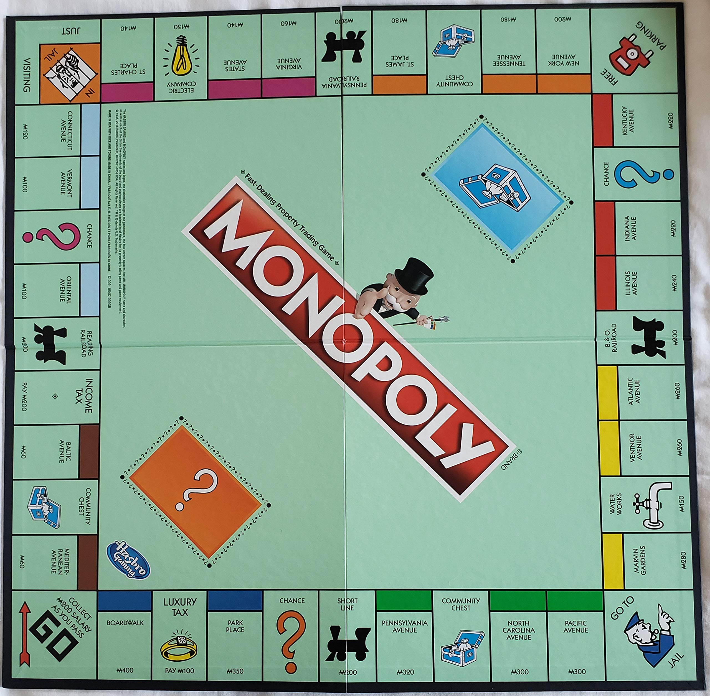

<!-- To render the lecture in Rmarkdown, enter the command below in the R console -->
<!-- rmarkdown::render("lecture22.Rmd") -->

```{r, include=FALSE}
	set.seed(123)
	options(digits=5)
```

## Bayes-spotting

```{r, out.width="700px",echo=FALSE,fig.align="center"}
	
```


(Pritchard, Stephens, and Donnelley 2000)

## Bayesian inference in Structure
"The Bayesian approach provides a coherent framework for incorporating the inherent uncertainty of parameter estimates into the inference procedure and for evaluating the strength of evidence for the inferred clustering. It also eases the incorporation of various sorts of prior information that may be available, such as information about the geographic sampling location of individuals."

(Pritchard, Stephens, and Donnelley 2000)

## The model underlying Structure

$Pr(Z,P∣X)∝Pr(Z)Pr(P)Pr(X∣Z,P)$

$X$ = genotypes of individuals (the data)\
$Z$ = the populations each individual comes from\
$P$ = the allele frequencies in these populations\
(note $Pr$ stands for probability here)\

## Priors in Structure

$Pr(z_{i} = k) = 1/K$

The probability that the $i^{th}$ individual is from a specific pop is equal to 1 divided by the total numbers of pops.

They note in discussion that you could adjust this if you had geographic information about individuals.

The prior for the allele frequencies also comes from a uniform distribution.

Read more here in the original paper https://doi.org/10.1093/genetics/155.2.945
and perspective from Novembre 10.1534/genetics.116.195164


## Class goals

- Understand the intuition behind MCMC

- Use MCMC to sample the posterior distribution

## Bayes' Theorem {.build}
Recall: 


$\large{p(H \; \mid \; D) = \frac{p(D \; \mid \; H) \; \times \; p(H)}{p(D)}}$

$p(D \; \mid \; H)$ is the _likelihood_ of the data given the model

## Prior probability distributions {.build}

```{r,echo=FALSE,,fig.height=5.5,fig.width=7.5}
flips1 <- 4
flips2 <- 52
p.seq <- seq(1e-4,1-1e-4,length.out=500)

	lnL.foo <- function(flips,n,p){
		lnL <- sum(dbinom(flips,n,p,log=TRUE))
		return(lnL)
	}

	lnL1 <- sapply(p.seq,function(p){lnL.foo(flips1,n=10,p=p)})
	lnL2 <- sapply(p.seq,function(p){lnL.foo(flips2,n=100,p=p)})
	pr1 <- dunif(p.seq,log=TRUE)
	pr2 <- dbeta(p.seq,3,3,log=TRUE)
	pr3 <- dbeta(p.seq,1/10,1/10,log=TRUE)	

plot(p.seq,type='n',ylim=c(-2,2),xlim=c(0,1),ylab="log prior probability",main="Possible Priors",xlab="values of p")
		lines(p.seq,pr1,lwd=3,col="blue")
			text(x=0.5,y=0.2,col="blue",font=2,labels="aliens",cex=2)
		lines(p.seq,pr2,lwd=3,col="green")
			text(x=0.5,y=1,col="green",font=2,labels=">1 rodeo",cex=2)
		lines(p.seq,pr3,lwd=3,col="purple")
			text(x=0.5,y=-1.45,col="purple",font=2,labels="shifty dude",cex=2)
		
```

## How do priors affect the posterior?

```{r,echo=FALSE,fig.height=5.5,fig.width=7.5}
plot(p.seq,lnL1,ylim=c(-15,5),type='l',col=2,lwd=2,ylab="log posterior probability",xlab="values of p",
	 	main=sprintf("10 coin flips (%s heads)",flips1))
	legend(x="topleft",lty=1,col=c("red","blue","green","purple"),
			legend=c("log-likelihood","uniform prior",">1 rodeo prior","shifty dude prior"),
			lwd=3)
```

## How do priors affect the posterior?

```{r,echo=FALSE,fig.height=5.5,fig.width=7.5}
plot(p.seq,lnL1,ylim=c(-15,5),type='l',col=2,lwd=2,ylab="log posterior probability",xlab="values of p",
	 	main=sprintf("10 coin flips (%s heads)",flips1))
	lines(p.seq,lnL1+pr1,col="blue",lwd=2,lty=2)
	lines(p.seq,lnL1+pr2,col="green",lwd=2,lty=2)
	lines(p.seq,lnL1+pr3,col="purple",lwd=2,lty=2)
	legend(x="topleft",lty=1,col=c("red","blue","green","purple"),
			legend=c("log-likelihood","uniform prior",">1 rodeo prior","shifty dude prior"),
			lwd=3)
```


## ML vs. Bayesian inference {.build}

Maximum likelihood inference:

 - focused on finding the parameter MLEs with a variety of algorithms 
 
 - in class we have focused on grid search.

  
Bayesian inference:

 - focused on describing the _posterior distribution_ - 
	+ a distribution of the probability of $p(H \mid \text{D})$
	over parameter values

 - for complicated problems, uses a Markov chain Monte Carlo 
   to characterize the posterior distribution
   
## Sampling the posterior distribution

Why not just keep grid searching?

- slow

- inefficient

- need to arbitrarily pick your grid

## Markov chain Monte Carlo {.build}

 - I'm going to explain what the "MCMC" stands for...

	+ [but it might not make much sense]
 
 - Then illustrate what an MCMC is
 
 - Then come back to the terms, and hopefully all will be clear.

## Markov chain Monte Carlo {.build}

- A _Markov chain_ is a stochastic process that satisfies the _Markov property_, 
	which means it is _memoryless_
	
## Markov chains

```{r, out.width="750px",echo=FALSE,fig.align="center"}
	
```

## Markov chains

```{r, out.width="750px",echo=FALSE,fig.align="center"}
	
```

## Markov chains

```{r, out.width="750px",echo=FALSE,fig.align="center"}
	
```

## Markov chains

```{r, out.width="750px",echo=FALSE,fig.align="center"}
	
```

## What does memoryless mean here? {.build}

```{r, out.width="750px",echo=FALSE,fig.align="center"}
	
```

## Monopoly as a markov chain

```{r, out.width="500px",echo=FALSE,fig.align="center"}
	
```
	
## Monopoly as a markov chain
```{r, out.width="500px",echo=FALSE,fig.align="center"}
	
```

## Markov chain Monte Caro {.build}

- _Monte Carlo_ is a reference to the Monte Carlo casino in Monaco

- _Monte Carlo methods_ rely on repeated random sampling to obtain numerical results

## Monte Carlo methods: example {.build}

Finding the area of a circle using Monte Carlo simulation:
<div class="centered">
```{r mc_circle_area_samples,echo=FALSE,fig.width=6,fig.height=5}
make.circle <- function(centerX,centerY,radius,fineness){
	# recover()
	coords <- matrix(c(centerX,centerY),nrow=fineness,ncol=2,byrow=TRUE)
	angles <- seq(0,2*pi,length.out=fineness)
	for(i in 1:fineness){
		coords[i,] <- coords[i,] + radius * c(cos(angles[i]),sin(angles[i]))
	}
	return(coords)
}

plot(0,xlim=c(-0.3,2.3),ylim=c(-0.3,2.3),type='n',xlab="",ylab="",asp=1,bty='n')
	lines(make.circle(1,1,1,100),lwd=3)
	rect(0,0,2,2,lwd=1)
```
</div>


## Monte Carlo methods: example
<div class="centered">
```{r monte_carlo_circle,fig.show="animate",fig.width=6,fig.height=5,interval=0.5,cache=TRUE,echo=FALSE,aniopts="controls"}
point.in.circle <- function(z,circle.center,radius){
	pic <- ifelse(sqrt(sum((z - circle.center)^2)) < radius,
					TRUE,
					FALSE)
	return(pic)
}

n.reps <- 1e5
x.range <- c(0,2)
y.range <- c(0,2)
Z <- cbind(runif(n.reps,x.range[1],x.range[2]),
		   runif(n.reps,x.range[1],x.range[2]))
pic <- apply(Z,1,function(z){point.in.circle(z,c(1,1),1)})

for(i in seq(0,n.reps,length.out=51)){
	plot(0,xlim=c(-0.3,2.3),ylim=c(-0.3,2.3),type='n',xlab="",ylab="",asp=1,bty='n',
			main=sprintf("Area = %s",round(4*sum(pic[1:i])/i,5)))
		lines(make.circle(1,1,1,100),lwd=3)
		rect(0,0,2,2,lwd=1)
	points(Z[1:i,,drop=FALSE],col=pic[1:i]+1,pch=20,cex=0.2)
}
```
</div>

## Monte Carlo methods: example

```{r,echo=FALSE}
n <- 1e2
plot(0,type='n',xlab="no. replicates",ylab="estimated circle area",xlim=c(0,1e3),ylim=c(2.5,4.1))
	lines(4*cumsum(pic[1:n])/c(1:n),lwd=2)
	abline(h=pi,col=2,lty=2)
```


## Monte Carlo methods: example

```{r,echo=FALSE}
n <- 5e2
plot(0,type='n',xlab="no. replicates",ylab="estimated circle area",xlim=c(0,1e3),ylim=c(2.5,4.1))
	lines(4*cumsum(pic[1:n])/c(1:n),lwd=2)
	abline(h=pi,col=2,lty=2)
```


## Monte Carlo methods: example

```{r,echo=FALSE}
n <- 1e3
plot(0,type='n',xlab="no. replicates",ylab="estimated circle area",xlim=c(0,n),ylim=c(2.5,4.1))
	lines(4*cumsum(pic[1:n])/c(1:n),lwd=2)
	abline(h=pi,col=2,lty=2)
```


## Monte Carlo methods: example

```{r,echo=FALSE}
n <- 1e4
plot(0,type='n',xlab="no. replicates",ylab="estimated circle area",xlim=c(0,n),ylim=c(2.5,4.1))
	lines(4*cumsum(pic[1:n])/c(1:n),lwd=2)
	abline(h=pi,col=2,lty=2)
```

## Monte Carlo methods: example

```{r,echo=FALSE}
n <- n.reps
plot(0,type='n',xlab="no. replicates",ylab="estimated circle area",xlim=c(0,n),ylim=c(2.5,4.1))
	lines(4*cumsum(pic[1:n])/c(1:n),lwd=2)
	abline(h=pi,col=2,lty=2)
```

The Law of Large Numbers!

## MC + MC {.build}
- _Markov chain_ : memoryless stochastic process

- _Monte Carlo_ : repeated random sampling

- If we randomly sample (Monte Carlo) from the Markov chain, we can describe our probability distribution.

## Using MCMC to sample the posterior distribution {.build}

$\Large{p(H \; \mid \; D) = \frac{p(D \; \mid \; H) \; \times \; p(H)}{p(D)}}$

We want to find the $H$ associated with the highest $p(H \mid D)$.

## MCMC: Metropolis-Hastings algorithm {.build}

1\. Initiate chain with an arbitrarily chosen value for parameter $H$
2\. Calculate the numerator of Bayes' Theorem using $H$

<div class="centered">
$\large{p(\text{D} \; \mid \; H) \times p(H)}$
</div>

3\. Propose an updated parameter value, $H'$\
4\. Calculate $p(\text{D} \; \mid \; H') \times p(H')$\
5\. Calculate $R$

<div class="centered">
$R = \frac{\Large{p(\text{D} \; \mid \; H') \; \times \; p(H')}}{\Large{p(\text{D} \; \mid \; H) \; \times \; p(H)}}$
</div>

6\. If R $\geq$ U(0,1), accept the proposed update, ($H \gets H'$)\
  Elsewise, $H \gets H$

Repeat steps 3-6 many times.

## MCMC: Metropolis-Hastings algorithm
<span style="color:lightgray">
1\. Initiate chain with an arbitrarily chosen value for parameter $H$
2\. Calculate the numerator of Bayes' Theorem using $H$</span>

<div class="centered">
<span style="color:lightgray"> $\large{p(\text{D} \; \mid \; H) \times p(H)}$</span>
</div>

3\. Propose an updated parameter value, $H'$\
<span style="color:lightgray">
4\. Calculate $p(\text{D} \; \mid \; H') \times p(H')$\
5\. Calculate $R$</span>

<div class="centered">
<span style="color:lightgray">$R = \frac{\Large{p(\text{D} \; \mid \; H') \; \times \; p(H')}}{\Large{p(\text{D} \; \mid \; H) \; \times \; p(H)}}$</span>
</div>
<span style="color:lightgray">
6\. If R $\geq$ U(0,1), accept the proposed update, ($H' \gets H$)\
  Elsewise, $H \gets H$

<span style="color:lightgray">Repeat steps 3-6 many times.</span>

## MCMC: Proposing parameter updates {.build}

How do we propose a new parameter value?

The simplest proposal mechanism is just to add a small, normally distributed random value to the current value:

$\LARGE{x \sim \mathcal{N}(\mu=0,\sigma)\\ H' = H + x}$

## MCMC: Metropolis-Hastings algorithm
<span style="color:lightgray">
1\. Initiate chain with an arbitrarily chosen value for parameter $H$
2\. Calculate the numerator of Bayes' Theorem using $H$</span>

<div class="centered">
<span style="color:lightgray"> $\large{p(\text{D} \; \mid \; H) \times p(H)}$</span>
</div>

3\. Propose an updated parameter value, $H'$\
<span style="color:lightgray">
4\. Calculate $p(\text{D} \; \mid \; H') \times p(H')$\
5\. Calculate $R$</span>

<div class="centered">
<span style="color:lightgray">$R = \frac{\Large{p(\text{D} \; \mid \; H') \; \times \; p(H')}}{\Large{p(\text{D} \; \mid \; H) \; \times \; p(H)}}$</span>
</div>
<span style="color:lightgray">
6\. If R $\geq$ U(0,1), accept the proposed update, ($H \gets H'$)\
  Elsewise, $H \gets H$

<span style="color:lightgray">Repeat steps 3-6 many times.</span>

## MCMC: Metropolis-Hastings algorithm
<span style="color:lightgray">
1\. Initiate chain with an arbitrarily chosen value for parameter $H$
2\. Calculate the numerator of Bayes' Theorem using $H$</span>

<div class="centered">
<span style="color:lightgray"> $\large{p(\text{D} \; \mid \; H) \times p(H)}$</span>
</div>

<span style="color:lightgray">
3\. Propose an updated parameter value, $H'$\
4\. Calculate $p(\text{D} \; \mid \; H') \times p(H')$\
5\. Calculate $R$</span>

<div class="centered">
$R = \frac{\Large{p(\text{D} \; \mid \; H') \; \times \; p(H')}}{\Large{p(\text{D} \; \mid \; H) \; \times \; p(H)}}$
</div>
<span style="color:lightgray">
6\. If R $\geq$ U(0,1), accept the proposed update, ($H \gets H'$)\
  Elsewise, $H \gets H$

<span style="color:lightgray">Repeat steps 3-6 many times.</span>

## MCMC: p(D)

Notice, we're calculating only the numerator of Bayes' Theorem for $H$ and $H'$.

Why aren't we calculating the denominator?  Because it cancels out!

<div class="centered">
$\large 
\begin{align}
R &= \frac{  \frac{p(\text{D} \; \mid \; H') \; \times \; p(H')}{p(D)}}{  \frac{p(\text{D} \; \mid \; H) \; \times \; p(H)}{p(D)}} \\
\\
&= \frac{p(\text{D} \; \mid \; H') \; \times \; p(H')}{p(\text{D} \; \mid \; H) \; \times \; p(H)}
\end{align}$
</div>


## MCMC: illustrated with coinage {.build}

```{r,echo=FALSE}
set.seed(123)
```

```{r}
# simulate data 
flips <- rbinom(n=1, size=10, prob=0.7)
```

```{r}
# define a prior log probability function (we are coin novices)
ln.prior <- function(p){
	return(dunif(x=p, min=0, max=1, log=TRUE))
}
```

```{r}
# define a log-likelihood function
ln.L <- function(flips,n,p){
	return(dbinom(x=flips, size=n, prob=p, log=TRUE))
}
```

```{r}
# define a posterior probability function
ln.post <- function(flips,n,p){
	return(ln.L(flips,n,p) + ln.prior(p)) 
  ##note that we can add because it's logs
}
```


## MCMC: Exploring the posterior

```{r,echo=FALSE,fig.width=7.5,fig.height=5}
	plot(0,xlim=c(0,1),ylim=c(-15,0),type='n',ylab="posterior probability",xlab="values of p")	
```

## MCMC: first stop on the Markov chain

```{r,echo=FALSE,fig.width=7.5,fig.height=5}
	plot(0,xlim=c(0,1),ylim=c(-15,0),type='n',ylab="posterior probability",xlab="values of p")
		p <- 0.2
		points(p,ln.post(flips,10,p),pch=19,cex=2)
```

## MCMC: Updating to $H$'

```{r,echo=FALSE,fig.width=7.5,fig.height=5}
	plot(0,xlim=c(0,1),ylim=c(-15,0),type='n',ylab="posterior probability",xlab="values of p")
		p.prime <- p + rnorm(1,0,0.1)
		points(p,ln.post(flips,10,p),pch=19,cex=2)
		points(p.prime,ln.post(flips,10,p.prime),pch=1,cex=2)
		R <- exp(ln.post(flips,10,p.prime) - ln.post(flips,10,p))
		u <- runif(1)
```

## Poll! A to stay, B to move to $H$'

```{r,echo=FALSE,fig.width=7.5,fig.height=5}
	plot(0,xlim=c(0,1),ylim=c(-15,0),type='n',ylab="posterior probability",xlab="values of p")
		points(p,ln.post(flips,10,p),pch=19,cex=2)
		points(p.prime,ln.post(flips,10,p.prime),pch=1,cex=2)
		R <- exp(ln.post(flips,10,p.prime) - ln.post(flips,10,p))
		u <- runif(1)
```

## MCMC: calculating R

```{r,echo=FALSE,fig.width=7.5,fig.height=5}
	mcmc.title <- sprintf("R = %s, u ~ U(0,1) = %s\n %s",round(R,4),round(u,4),ifelse(R>u,"R > u,    p <- p'","R < u,    p <- p"))
	accept <- R > u
	plot(0,xlim=c(0,1),ylim=c(-15,0),type='n',ylab="posterior probability",xlab="values of p",
		main=mcmc.title)
		points(p,ln.post(flips,10,p),pch=19,cex=2)
		points(p.prime,ln.post(flips,10,p.prime),pch=1,cex=2)
```


## MCMC: The next step

```{r,echo=FALSE,fig.width=7.5,fig.height=5}
	plot(0,xlim=c(0,1),ylim=c(-15,0),type='n',ylab="posterior probability",xlab="values of p",
		main=mcmc.title)
		if(!accept){
			points(p,ln.post(flips,10,p),pch=19,cex=2)
		} else {
			points(p.prime,ln.post(flips,10,p.prime),pch=19,cex=2)
		}
	p <- ifelse(accept,p.prime,p)
```

## MCMC: The next step

```{r,echo=FALSE,fig.width=7.5,fig.height=5}
	plot(0,xlim=c(0,1),ylim=c(-15,0),type='n',ylab="posterior probability",xlab="values of p")
		p.prime <- p + rnorm(1,0,0.1)
		points(p,ln.post(flips,10,p),pch=19,cex=2)
		points(p.prime,ln.post(flips,10,p.prime),pch=1,cex=2)
		R <- exp(ln.post(flips,10,p.prime) - ln.post(flips,10,p))
		u <- runif(1)
```

## MCMC: The next step

```{r,echo=FALSE,fig.width=7.5,fig.height=5}
	mcmc.title <- sprintf("R = %s, u ~ U(0,1) = %s\n %s",round(R,4),round(u,4),ifelse(R>u,"R > u,    p <- p'","R < u,    p <- p"))
	accept <- R > u
	plot(0,xlim=c(0,1),ylim=c(-15,0),type='n',ylab="posterior probability",xlab="values of p",
		main=mcmc.title)
		points(p,ln.post(flips,10,p),pch=19,cex=2)
		points(p.prime,ln.post(flips,10,p.prime),pch=1,cex=2)
```

## MCMC: the tale of a robot explorer

```{r,echo=FALSE,fig.width=7.5,fig.height=5}
	plot(0,xlim=c(0,1),ylim=c(-15,0),type='n',ylab="posterior probability",xlab="values of p",
		main=mcmc.title)
		if(!accept){
			points(p,ln.post(flips,10,p),pch=19,cex=2)
		} else {
			points(p.prime,ln.post(flips,10,p.prime),pch=19,cex=2)
		}
	p <- ifelse(accept,p.prime,p)
```

## MCMC example: 50 iterations {.build}

```{r,echo=FALSE}
binom.mcmc <- function(n.iter,flips,n,ylim,viz=TRUE){
	p.samples <- rep(NA,n.iter)
	if(viz){
		par(mar=c(1,4,1,1))
		layout(matrix(c(rep(1,5),rep(2,20)),nrow=5,ncol=5,byrow=TRUE))
	}
	p <- runif(1)
	post <- ln.post(flips,n,p)
	for(i in 1:n.iter){
		p.prime <- p + rnorm(1,0,0.05)
		post.prime <- -Inf
		if(is.finite(ln.prior(p.prime))){
			post.prime <- ln.post(flips,n,p.prime)
		}
		if(exp(post.prime-post) > runif(1)){
			p <- p.prime
		}
		p.samples[i] <- p
		if(viz){
			plot(0,xlim=c(1,n.iter),ylim=c(0,1),type='n',ylab="values of p")
				lines(1:i,p.samples[1:i])
			plot(0,xlim=c(0,1),ylim=ylim,type='n',ylab="posterior probability",xlab="values of p")
				points(p.samples[1:i],ln.post(flips,n,p.samples[1:i]),pch=20,col=adjustcolor(1,0.5))
		}
	}
	return(p.samples)
}
```

```{r binomial_mcmc,fig.show="animate",fig.width=5,interval=0.1,cache=TRUE,echo=FALSE,aniopts="controls"}
	tmp <- binom.mcmc(n.iter = 50,flips = flips,n = 10, ylim = c(-15,0))
```

## MCMC example, 500 iterations {.build}

```{r binomial_mcmc2,fig.show="animate",fig.width=5, interval=0.05,cache=TRUE,echo=FALSE,aniopts="controls"}
	tmp <- binom.mcmc(n.iter = 500,flips = flips,n = 10, ylim = c(-15,0))
```

## MCMC example: 5000 iterations

```{r binomial_mcmc3, fig.width=5,cache=TRUE,echo=FALSE}
	p.samples <- binom.mcmc(n.iter = 5000,flips = flips,n = 10, ylim = c(-15,0),viz=FALSE)
	par(mar=c(1,4,1,1))
	layout(matrix(c(rep(1,5),rep(2,20)),nrow=5,ncol=5,byrow=TRUE))
	plot(0,xlim=c(1,length(p.samples)),ylim=c(0,1),type='n',ylab="values of p")
		lines(p.samples)
	plot(0,xlim=c(0,1),ylim=c(-15,0),type='n',ylab="posterior probability",xlab="values of p")
		points(p.samples,ln.post(flips,10,p.samples),pch=20,col=adjustcolor(1,0.01))
```

## MCMC example: 50,000 iterations

```{r binomial_mcmc4, fig.width=5,cache=TRUE,echo=FALSE}
	p.samples <- binom.mcmc(n.iter = 5e5,flips = flips,n = 10, ylim = c(-15,0),viz=FALSE)
	par(mar=c(1,4,1,1))
	layout(matrix(c(rep(1,5),rep(2,20)),nrow=5,ncol=5,byrow=TRUE))
	plot(0,xlim=c(1,length(p.samples)),ylim=c(0,1),type='n',ylab="values of p")
		lines(p.samples)
	plot(0,xlim=c(0,1),ylim=c(-15,0),type='n',ylab="posterior probability",xlab="values of p")
		points(p.samples,ln.post(flips,10,p.samples),pch=20,col=adjustcolor(1,0.005))
```

## Markov chain Monte Carlo {.build}

 - Where the chain goes depends _only_ on where it currently is
	+ Markov property
\
\
 - Repeated, random sampling (both in our proposal mechanism and acceptance probabilities) 
 allows us to explore the posterior distribution
	+ Monte Carlo method
	
## Breakout room exercise:

Navigate to today's class in d2l and download Class_21_breakoutroom_exercise.Rmd

Work through the exercise with your group!


## MCMC recap: {.build}

If we were to run our chain forever, it would visit each location 
in parameter space _in proportion to_ the posterior probability of that location

Assuming the analysis was successful, the distribution of parameter estimates 
is the posterior distribution.


## MCMC recap: {.build}

```{r,echo=FALSE,fig.width=6,fig.height=5}
	hist(p.samples,
			xlab="parameter estimates",
			ylab="frequency",
			main="posterior distribution of p",breaks=1e3)
```

## MCMC recap:

```{r,echo=FALSE,fig.width=6,fig.height=5}
	hist(p.samples,
			xlab="parameter estimates",
			ylab="frequency",
			main="posterior distribution of p",breaks=1e3)
		abline(v=quantile(p.samples,c(0.025,0.975)),col="red",lwd=3)
			text(0.15+quantile(p.samples,c(0.025,0.975))[1],100,col=2,label="95% \ncredible interval")
		abline(v=mean(p.samples),col="blue",lwd=3)
			text(-0.05+mean(p.samples),550,col="blue",label="mean")
		abline(v=p.samples[which.max(ln.post(flips,10,p.samples))],col="green",lwd=3)
			text(0.05+p.samples[which.max(ln.post(flips,10,p.samples))],550,col="green",label="MAP")
```

## Bayesian recap: {.build}

As Bayesians:

 - we're focused on describing the _posterior distribution_ - 
	+ a distribution of the probability of $p(H \mid \text{D})$
	over parameter values

 - for complicated problems, we use a Markov chain Monte Carlo 
   to characterize the posterior distribution

MCMC: 

- _Markov chain_ (memoryless stochastic process) _Monte Carlo_ (repeated random sampling)

- An algorithm for sampling from a probability distribution

- Specifically, an algorithm for characterizing the posterior probability distribution