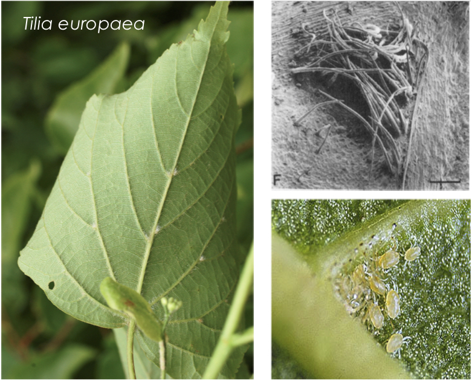
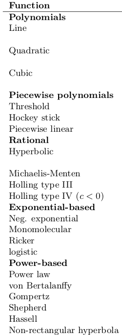

<style>
.forceBreak { -webkit-column-break-after: always; break-after: column; }
</style>

<!-- To render the lecture in Rmarkdown, enter the command below in the R console -->
<!-- rmarkdown::render("lecture23.Rmd") -->

```{r,echo=FALSE}
	#set any global options
	set.seed(123)
	options(digits=3)
	col.func <- function (x, cols, col2 = NULL) {
	    cols <- ifelse(is.null(col2), cols, c(col1, col2))
	    cols <- colorRampPalette(cols)(length(x))[findInterval(x, 
	        sort(x))]
	    return(cols)
	}
	setwd('~/Documents/ibio830/x23-Deterministic-Functions/')
```

## Bird's-eye view

Step 7: say something _quantitative_ and _objective_ about 
the effect of a predictor on a response.

Step 6: run model (use likelihood-based 
inference and an algorithm to estimate values of parameters of the model)

Step 5: build a model (make choices about how we think our data are distributed 
and the nature of the relationship between predictor and response)

Step 4: know about prob. distributions and deterministic functions 

Step 3: understand the concept of likelihood

Step 2: understand the rules of probability

Step 1: be able to do stuff in R

 
## E.g., Mite makes right

```{r, out.width="650px",echo=FALSE,fig.align="center"}
	
```
  
## E.g., Mite makes right

Download "miteData.txt" from d2l.

```{r,echo=FALSE, eval=FALSE}
n.samples <- 150
n.mites <- sample(0:50,n.samples,replace=TRUE)
fungus.mite.beta <- -0.08
fungus.mite.alpha <- 25
fungus.mite.sigma <- 2
mean.dry.wt.fungus <- fungus.mite.alpha * exp(fungus.mite.beta*n.mites)
dry.wt.fungus <- rnorm(n.samples,mean=mean.dry.wt.fungus,sd=fungus.mite.sigma)
dry.wt.fungus[dry.wt.fungus < 0] <- 0
leaf.dmg.fungus.beta <- 1.4
leaf.dmg.fungus.alpha <- 15
leaf.dmg.fungus.sigma <- 7
lf.dmg <- function(x){
	return(15+1.4*x)
}
mean.leaf.dmg <- leaf.dmg.fungus.beta*dry.wt.fungus + leaf.dmg.fungus.alpha
leaf.dmg <- rnorm(n.samples,mean=mean.leaf.dmg,sd=leaf.dmg.fungus.sigma)
miteData <- data.frame(n.mites,dry.wt.fungus, leaf.dmg)
write.table(miteData, file="miteData.txt", quote=F, col.names = T, row.names=F)
#save(n.mites, dry.wt.fungus, leaf.dmg, file="miteData.rda")
```

```{r, echo=T, eval=F}
load('miteData.txt')
ls()
```

## How does dry fungus weight affect leaf damage?

Use a plot to compare the data

## How does dry fungus weight affect leaf damage?

```{r, echo=F}
mean.leaf.dmg <- leaf.dmg.fungus.beta*dry.wt.fungus + leaf.dmg.fungus.alpha
leaf.dmg <- rnorm(n.samples,mean=mean.leaf.dmg,sd=leaf.dmg.fungus.sigma)
plot(dry.wt.fungus,leaf.dmg,
	 main="Fungal prevalence increases leaf damage",
	 xlab="dry fungus weight per leaf (mg)",
	 ylab="leaf damage relative to control (mg)",pch=19,col=adjustcolor(1,0.5))
```


## E.g., Mite makes right

Our research question: 

By how much does each additional mg of fungus increase the leaf damage?


## Modeling leaf damage

We already know that different data can be well described 
by different probability distributions.

\
\

<div class="centered">
$\large \text{outcomes} \sim \text{Distribution}(H)$
</div>

\
\

E.g., plant damage caused by fungal load

## How is leaf damage distributed? {.build}

```{r,echo=FALSE}
hist(leaf.dmg,xlim=range(leaf.dmg)+c(-30,30),col=adjustcolor(1,0.5),
		main="Distribution of leaf damage",xlab="Leaf damage relative to control")
```

<div class="centered">
$\large \text{LeafDamage} \sim \mathcal{N}(\vec{H}=\{\mu,\sigma\})$
</div>


## What is the mean of this distribution? {.build}

The idea behind model building is that you can plug 
a deterministic function into the parameters of a model:

\
\

<div class="centered">
$\large \text{outcomes} \sim \text{Distribution}(H)$
</div>

\
\

<div class="centered">
$\large \text{outcome}_i \sim \text{Distribution}(H_i = f(\text{predictor}_i))$
</div>

## Leaf damage is normally distributed, with a mean of... {.build}

```{r,echo=FALSE,fig.width=7,fig.height=3.5}
par(mfrow=c(1,2))
hist(leaf.dmg,xlim=range(leaf.dmg)+c(-30,30),col=adjustcolor(1,0.5),
		main="",xlab="Leaf damage relative to control")
plot(dry.wt.fungus,leaf.dmg,
	 main="",
	 xlab="dry fungus weight per leaf (mg)",
	 ylab="leaf damage relative to control (mg)",pch=19,col=adjustcolor(1,0.5))
```

## Leaf damage is normally distributed, with a mean of... {.build}


\
\

$\large \text{LeafDamage} \sim \mathcal{N}(\mu,\sigma)$

\
\

$\large \text{LeafDamage}_i \sim \mathcal{N}(\mu_i=f(\text{FungusWt}_i),\sigma)$

## The deterministic equation in the model

\
\

$\large \text{LeafDamage} \sim \mathcal{N}(\mu,\sigma)$

\
\

$\large \text{LeafDamage}_i \sim \mathcal{N}(\boldsymbol{\mu_i=f(\text{FungusWt}_i)},\sigma)$

## A linear model of leaf damage

<div class="centered">
$\text{LeafDamage}_i \sim \mathcal{N}(\mu_i=f(\text{FungusWt}_i),\sigma)$
</div>

```{r,echo=FALSE,fig.width=7.5,fig.height=5}
plot(dry.wt.fungus,leaf.dmg,
	 main="",
	 xlab="dry fungus weight per leaf (mg)",
	 ylab="leaf damage relative to control (mg)",pch=19,col=adjustcolor(1,0.5))
```

## A linear model of leaf damage

<div class="centered">
$\text{LeafDamage}_i \sim \mathcal{N}(\mu_i=f(\text{FungusWt}_i),\sigma)$
</div>

```{r,echo=FALSE,fig.width=7.5,fig.height=5}
plot(dry.wt.fungus,leaf.dmg,
	 main="",
	 xlab="dry fungus weight per leaf (mg)",
	 ylab="leaf damage relative to control (mg)",pch=19,col=adjustcolor(1,0.5))
abline(a=leaf.dmg.fungus.alpha,b=leaf.dmg.fungus.beta,col=2,lwd=3,lty=2)
```


## A linear model of leaf damage

<div class="centered">
$\text{LeafDamage}_i \sim \mathcal{N}(\mu_i=f(\text{FungusWt}_i),\sigma)$
</div>

```{r,echo=FALSE,fig.width=7.5,fig.height=5}
plot(dry.wt.fungus,leaf.dmg,
	 main="",
	 xlab="dry fungus weight per leaf (mg)",
	 ylab="leaf damage relative to control (mg)",pch=19,col=adjustcolor(1,0.5))
abline(a=leaf.dmg.fungus.alpha,b=leaf.dmg.fungus.beta,col=2,lwd=3,lty=2)
abline(v=10,lty=2)
TeachingDemos::subplot(fun = {
							plot(0,type='n',xlim=c(12,47),ylim=c(0,0.07),xlab="",ylab="probability",bty="n")
							lines(seq(0,57,length.out=500),
									dnorm(seq(0,57,length.out=500),
									mean=lf.dmg(10),
									sd=leaf.dmg.fungus.sigma))
							abline(v=29,col=2,lwd=2,lty=2)
							box(lwd=1.5,lty=2)
						},
						x = c(0.65*max(dry.wt.fungus),max(dry.wt.fungus)),
						y = c(0.15*max(leaf.dmg),0.45*max(leaf.dmg)))
```

## A linear model of leaf damage

<div class="centered">
$\text{LeafDamage}_i \sim \mathcal{N}(\mu_i=f(\text{FungusWt}_i),\sigma)$
</div>

```{r, echo=FALSE,fig.width=7.5,fig.height=5}
	dx <- seq(-10,100,length.out=500)
	nrm.cols <- colorRampPalette(c("darkblue","lightblue"))(20)
	par(mfrow=c(1,2))
plot(dry.wt.fungus,leaf.dmg,
	 main="",
	 xlab="dry fungus weight per leaf (mg)",
	 ylab="leaf damage relative to control (mg)",pch=19,col=adjustcolor(1,0.5))
abline(a=leaf.dmg.fungus.alpha,b=leaf.dmg.fungus.beta,col=2,lwd=3,lty=2)
	abline(v=c(5,10,15,20),col=nrm.cols[c(5,10,15,20)],lwd=3)
	plot(0,xlab="leaf damage",ylab="probability of leaf damage",xlim=c(5,60),ylim=c(0,0.08),type='n')
	legend(x="topright",title="fungus wt.",lty=1,lwd=2,col=c("darkblue","lightblue"),legend=c("5","20"))
	lapply(1:5,
		function(i){
			lines(dx,
					dnorm(dx,
	  					  mean=lf.dmg(c(5,10,15,20)[i]),
					      sd=leaf.dmg.fungus.sigma),
				    lwd = 2,
				    col=nrm.cols[c(5,10,15,20)[i]])
		})
```


## A linear model of leaf damage

```{r,echo=FALSE,fig.width=7.5,fig.height=5.5}
plot(dry.wt.fungus,leaf.dmg,
	 main="",
	 xlab="dry fungus weight per leaf (mg)",
	 ylab="leaf damage relative to control (mg)",pch=19,col=adjustcolor(1,0.5))
abline(a=leaf.dmg.fungus.alpha,b=leaf.dmg.fungus.beta,col=2,lwd=3,lty=2)
```


## A linear model of leaf damage

```{r,echo=FALSE,fig.width=7.5,fig.height=5.5}


plot(dry.wt.fungus,leaf.dmg,
	 main="",
	 xlab="dry fungus weight per leaf (mg)",
	 ylab="leaf damage relative to control (mg)",pch=19,col=adjustcolor(1,0.5))
abline(a=leaf.dmg.fungus.alpha,b=leaf.dmg.fungus.beta,col=2,lwd=3,lty=2)
pt1 <- 5
pt2 <- 15
segments(x0=pt1,x1=pt1,y0=-100,y1=lf.dmg(pt1),col="goldenrod1",lwd=3,lty=3)
segments(x0=pt2,x1=pt2,y0=-100,y1=lf.dmg(pt2),col="goldenrod1",lwd=3,lty=3)
```

## A linear model of leaf damage

```{r,echo=FALSE,fig.width=7.5,fig.height=5.5}
plot(dry.wt.fungus,leaf.dmg,
	 main="",
	 xlab="dry fungus weight per leaf (mg)",
	 ylab="leaf damage relative to control (mg)",pch=19,col=adjustcolor(1,0.5))
abline(a=leaf.dmg.fungus.alpha,b=leaf.dmg.fungus.beta,col=2,lwd=3,lty=2)
segments(x0=pt1,x1=pt1,y0=-100,y1=lf.dmg(pt1),col="goldenrod1",lwd=3,lty=3)
segments(x0=pt2,x1=pt2,y0=-100,y1=lf.dmg(pt2),col="goldenrod1",lwd=3,lty=3)
segments(x0=pt1,x1=pt1,y0=lf.dmg(pt1),y1=lf.dmg(pt2),col="blue",lwd=3,lty=3)
segments(x0=pt1,x1=pt2,y0=lf.dmg(pt2),y1=lf.dmg(pt2),col="blue",lwd=3,lty=3)
text(x=pt1-3,y=lf.dmg(pt1+(pt2-pt1)/2),labels=lf.dmg(pt2)-lf.dmg(pt1),cex=2,col="blue")
text(x=pt1 + (pt2-pt1)/2,y=lf.dmg(pt2)+4,labels=(pt2-pt1),cex=2,col="blue")

```

## A linear model of leaf damage

```{r,echo=FALSE,fig.width=7.5,fig.height=5.5}
plot(dry.wt.fungus,leaf.dmg,
	 main="",
	 xlab="dry fungus weight per leaf (mg)",
	 ylab="leaf damage relative to control (mg)",pch=19,col=adjustcolor(1,0.5))
pt1 <- 10
pt2 <- 20
abline(a=leaf.dmg.fungus.alpha,b=leaf.dmg.fungus.beta,col=2,lwd=3,lty=2)
segments(x0=pt1,x1=pt1,y0=-100,y1=lf.dmg(pt1),col="goldenrod1",lwd=3,lty=3)
segments(x0=pt2,x1=pt2,y0=-100,y1=lf.dmg(pt2),col="goldenrod1",lwd=3,lty=3)
segments(x0=pt1,x1=pt1,y0=lf.dmg(pt1),y1=lf.dmg(pt2),col="blue",lwd=3,lty=3)
segments(x0=pt1,x1=pt2,y0=lf.dmg(pt2),y1=lf.dmg(pt2),col="blue",lwd=3,lty=3)
text(x=pt1-3,y=lf.dmg(pt1+(pt2-pt1)/2),labels=lf.dmg(pt2)-lf.dmg(pt1),cex=2,col="blue")
text(x=pt1 + (pt2-pt1)/2,y=lf.dmg(pt2)+4,labels=(pt2-pt1),cex=2,col="blue")

```

## The linear part of the model {.build}

\

$\large \text{LeafDamage}_i \sim \mathcal{N}(\boldsymbol{\mu_i=f(\text{FungusWt}_i)},\sigma)$

\

$\large 
\begin{aligned}
\mu_i&=f(\text{FungusWt}_i) \\
&=\beta \times \text{FungusWt}_i + \alpha
\end{aligned}$

\
\

What are $\beta$ and $\alpha$?

## The linear part of the model {.build}

$\large \mu_i = \beta \times \text{FungusWt}_i + \alpha$


 - $\alpha$ is the **_intercept_**, 
and tells us the expected amount of leaf damage 
when the amount of fungus is 0.


 - $\beta$ is the **_effect size_** of our predictor variable (fungus weight), 
and gives us the change in expected response variable for each unit of predictor variable.

	+ i.e., how much more leaf damage we expect for each added milligram of fungus.

## The linear part of the model {.build}

```{r,echo=FALSE,fig.width=7.5,fig.height=5.5}
plot(dry.wt.fungus,leaf.dmg,
	 main="",
	 xlab="dry fungus weight per leaf (mg)",
	 ylab="leaf damage relative to control (mg)",pch=19,col=adjustcolor(1,0.5),
	 xlim=range(c(0,range(dry.wt.fungus))))
abline(a=leaf.dmg.fungus.alpha,b=leaf.dmg.fungus.beta,col=2,lwd=3,lty=2)
segments(x0=pt1,x1=pt1,y0=-100,y1=lf.dmg(pt1),col="goldenrod1",lwd=3,lty=3)
segments(x0=pt2,x1=pt2,y0=-100,y1=lf.dmg(pt2),col="goldenrod1",lwd=3,lty=3)
segments(x0=pt1,x1=pt1,y0=lf.dmg(pt1),y1=lf.dmg(pt2),col="blue",lwd=3,lty=3)
segments(x0=pt1,x1=pt2,y0=lf.dmg(pt2),y1=lf.dmg(pt2),col="blue",lwd=3,lty=3)
text(x=pt1-3,y=lf.dmg(pt1+(pt2-pt1)/2),labels=lf.dmg(pt2)-lf.dmg(pt1),cex=2,col="blue")
text(x=pt1 + (pt2-pt1)/2,y=lf.dmg(pt2)+4,labels=(pt2-pt1),cex=2,col="blue")
abline(h=leaf.dmg.fungus.alpha,lwd=3,col="forestgreen")
text(x=max(dry.wt.fungus)-max(dry.wt.fungus)/5,y=leaf.dmg.fungus.alpha+2,labels="intercept",col="forestgreen",cex=2)
```

## The linear part of the model {.build}

$\large \text{LeafDamage}_i \sim \mathcal{N}(\boldsymbol{\mu_i=f(\text{FungusWt}_i)},\sigma)$

\
\

$\large \mu_i = \beta \times \text{FungusWt}_i + \alpha$


 - This is called a linear regression (aka a **_linear model_**)
 	+ linear relationship between predictor and response
 	+ "Gaussian noise" aka data are normally distributed around predicted mean


## Error in a linear model

Gaussian noise ("normally distributed errors")

```{r,echo=FALSE,fig.width=7.5,fig.height=5}
par(mfrow=c(1,2))
	hist(leaf.dmg,xlim=range(leaf.dmg)+c(-30,30),col=adjustcolor(1,0.5),
		main="Distribution of leaf damage",xlab="Leaf damage relative to control")
	hist(leaf.dmg-mean.leaf.dmg,xlim=c(-30,30),col=adjustcolor(1,0.5),
		main="residuals",xlab="Leaf damage relative to control (residuals)")
```
	
## The two components of a linear model

$\large \text{LeafDamage}_i \sim \mathcal{N}(\boldsymbol{\mu_i=f(\text{FungusWt}_i)},\sigma)$

\

 - this relationship is stochastic

\
\
 
$\large \mu_i = \beta \times \text{FungusWt}_i + \alpha$

\

 - this relationship is **_deterministic_**
 	+ it has no randomness

## Parameter inference - linear regression {.build}

$\large \text{LeafDamage}_i \sim \mathcal{N}(\mu_i=f(\text{FungusWt}_i),\sigma)$


$\large \mu_i = \beta \times \text{FungusWt}_i + \alpha$

\

So what are the parameters of this model?

 - $\beta$, $\alpha$, and $\sigma$
 
 <div class="centered">
<span style="color:red">$\Huge{p(H \; \mid \; D) = \frac{p(D \; \mid \; H) \; \times \; p(H)}{p(D)}}$</span>
</div>

## Linear regression with Bayes theorem {.build}

<div class="centered"> 
$\large
p( \{\beta,\alpha,\sigma\} \mid \text{LfDmg}) = 
\frac{p(\text{LfDmg} \mid \{\beta,\alpha,\sigma\}) \times p(\{\beta,\alpha,\sigma\})}{p(\text{LfDmg})}$
</div>


```{r,echo=FALSE,fig.width=5,fig.height=4}
plot(dry.wt.fungus,leaf.dmg,
	 main="",
	 xlab="dry fungus weight per leaf (mg)",
	 ylab="leaf damage relative to control (mg)",pch=19,col=adjustcolor(1,0.5),
	 xlim=range(c(0,range(dry.wt.fungus))))
```

## Linear regression with Bayes theorem {.build}

<div class="centered"> 
$\large
p( \{\beta,\alpha,\sigma\} \mid \text{LfDmg}) = 
\frac{p(\text{LfDmg} \mid \{\beta,\alpha,\sigma\}) \times p(\{\beta,\alpha,\sigma\})}{p(\text{LfDmg})}$
</div>

\

### Priors

$\large \beta \sim \phantom{\mathcal{N}(\mu = 0,\sigma = 1)}$

$\large \alpha \sim \phantom{\mathcal{N}(\mu = 0,\sigma = 1)}$

$\large \sigma \sim \phantom{\text{Exp}(\lambda = 1)}$

## Linear regression with Bayes theorem {.build}

<div class="centered"> 
$\large
p( \{\beta,\alpha,\sigma\} \mid \text{LfDmg}) = 
\frac{p(\text{LfDmg} \mid \{\beta,\alpha,\sigma\}) \times p(\{\beta,\alpha,\sigma\})}{p(\text{LfDmg})}$
</div>

\

### Priors

$\large \beta \sim \mathcal{N}(\mu = 0,\sigma = 1e6)$

$\large \alpha \sim \mathcal{N}(\mu = 0,\sigma = 1e6)$

$\large \sigma \sim \text{Exp}(\lambda = 0.01)$

## Coding a linear regression w/ Bayes {.build}

```{r,eval=FALSE}
# Estimating the mean of a normal w/ log likelihood
ln.L <- function(y,mu,sigma){
	return(sum(
		dnorm(y,mean=mu,sd=sigma,log=TRUE)
	))
}

#ln.L(leaf.dmg, 23, 10)
```

```{r}
# Estimating the **parameters** of a function 
#		that determines the mean of a normal
ln.L <- function(y,x,alpha,beta,sigma){
	return(sum(
		dnorm(y,mean=alpha + beta * x,sd=sigma,log=TRUE)
	))
}

#ln.L(leaf.dmg, dry.wt.fungus, 15, 2, 10)
```

## Linear regression with Bayes Theorem and MCMC
(code is in the slide Rmd file)
```{r,echo=FALSE}
ln.post.prob <- function(y,x,alpha,beta,sigma){
	post.prob <- ifelse(sigma > 0,
						ln.L(y,x,alpha,beta,sigma) + 
						dnorm(alpha,mean=0,sd=1e6,log=TRUE) + 
						dnorm(beta,mean=0,sd=1e6,log=TRUE) + 
						dexp(sigma,rate=0.01,log=TRUE),
						-Inf)
	return(post.prob)
}
```


```{r LinearRegressionMCMC,echo=FALSE,cache=TRUE}
n.iter <- 1e6
samp.freq <- 2e3
alpha.sample <- rep(NA,1+n.iter/samp.freq)
beta.sample <- rep(NA,1+n.iter/samp.freq)
sigma.sample <- rep(NA,1+n.iter/samp.freq)
post.prob.sample <- rep(NA,1+n.iter/samp.freq)
alpha <- rnorm(1,0,1)
beta <- rnorm(1,0,1)
sigma <- rexp(1)
post.prob <- ln.post.prob(y=leaf.dmg,x=dry.wt.fungus,alpha=alpha,beta=beta,sigma=sigma)
alpha.sample[1] <- alpha
beta.sample[1] <- beta
sigma.sample[1] <- sigma
post.prob.sample[1] <- post.prob
for(i in 2:n.iter){
	alpha.prime <- alpha + rnorm(1,0,0.1)
	beta.prime <- beta + rnorm(1,0,0.1)
	sigma.prime <- sigma + rnorm(1,0,0.1)
	post.prob.prime <- ln.post.prob(y=leaf.dmg,x=dry.wt.fungus,alpha=alpha.prime,beta=beta.prime,sigma=sigma.prime)
	R <- exp(post.prob.prime - post.prob)
	if(R > runif(1)){
		alpha <- alpha.prime
		beta <- beta.prime
		sigma <- sigma.prime
		post.prob <- post.prob.prime
	}
	if(i %% samp.freq == 0){
		alpha.sample[1+i/samp.freq] <- alpha
		beta.sample[1+i/samp.freq] <- beta
		sigma.sample[1+i/samp.freq] <- sigma
		post.prob.sample[1+i/samp.freq] <- post.prob
	}
}
```

```{r,fig.width=7.5,fig.height=4,echo=FALSE}
	par(mfrow=c(1,3),mar=c(4,3,3,1))
	plot(alpha.sample,xlab="",ylab="",main="alpha",pch=20,col=adjustcolor(1,0.4)) ; abline(h= leaf.dmg.fungus.alpha,lwd=2,col=2)
	plot(beta.sample,xlab="MCMC iterations",ylab="",main="beta",pch=20,col=adjustcolor(1,0.4)) ; abline(h= leaf.dmg.fungus.beta,lwd=2,col=2)
	plot(sigma.sample,xlab="",ylab="",main="sigma",pch=20,col=adjustcolor(1,0.4)) ; abline(h= leaf.dmg.fungus.sigma,lwd=2,col=2)
```

## Comparing model estimates with the data

```{r,fig.width=7.5,fig.height=5,cache=TRUE,echo=FALSE}
	plot(dry.wt.fungus,leaf.dmg,pch=19,col=adjustcolor(1,0.5),
			xlab="dry fungus weight per leaf (mg)",
			ylab="leaf damage relative to control (mg)")
	invisible(
	sapply(1:50,function(i){
		abline(a=alpha.sample[2:501][i],b=beta.sample[2:501][i],col=adjustcolor(2,0.1),lwd=3)
	}))
	legend(x="bottomright",lwd=1,col=c("blue","red"),legend=c("true","estimated"))
	abline(a= leaf.dmg.fungus.alpha,b= leaf.dmg.fungus.beta,col="blue",lwd=3)
```

## Linear regression w/ maximum likelihood

```{r}
mydata <- data.frame("dry.wt.fungus" = dry.wt.fungus,"leaf.dmg" = leaf.dmg)
head(mydata)
```

## Linear regression w/ maximum likelihood

```{r}
mod1 <- lm(leaf.dmg ~ dry.wt.fungus,data=mydata)
mod1
```

```{r}
summary(mod1)$sigma
```
##

```{r}
summary(mod1)
```

##

```{r,fig.width=7.5,fig.height=5}
plot(mydata)
	abline(mod1)
```

## Model building recap: {.build}

 - we can plug a deterministic function into the 
 parameters of a probability distribution to estimate 
 the relationship between a predictor and response variable
 
 - $\large \text{outcome}_i \sim \text{Distribution}(H_i = f(\text{predictor}_i))$
 
 - we can then do inference on the parameters of that deterministic 
 function
 	+ using, e.g., Bayesian or Maximum Likelihood inference
 
\ 
 - when we do, we're calculating the likelihood of each 
 data point as a draw from a distribution parameterized 
 by the particular value of the predictor variable associated with it.
 
## Deterministic functions: nonlinearity!

```{r,fig.height=5,cache=TRUE,echo=FALSE}
plot(n.mites,dry.wt.fungus,
	 main="Mites decrease fungal prevalence",
	 xlab="Number of mites/cm2",
	 ylab="dry fungus weight per leaf(mg)",pch=19,col=adjustcolor(1,0.5))
```

## How would we model this data? {.build}

\

$\large \text{outcome}_i \sim \text{Distribution}(H_i = f(\text{predictor}_i))$

\

$\large \text{FungusWt}_i \sim \mathcal{N}(\mu_i=f(\text{nMites}_i),\sigma)$


 + mu = a + b * nMites

## How would we model this data? {.build}

\

$\large \text{outcome}_i \sim \text{Distribution}(H_i = f(\text{predictor}_i))$

\

$\large \text{FungusWt}_i \sim \mathcal{N}(\mu_i=f(\text{nMites}_i),\sigma)$


 + ~~mu = a + b * nMites~~


## Is fungal weight a linear function of mite density?

```{r,fig.height=5,cache=TRUE,echo=FALSE}
plot(n.mites,dry.wt.fungus,
	 main="Mites decrease fungal prevalence",
	 xlab="Number of mites/cm2",
	 ylab="dry fungus weight per leaf(mg)",pch=19,col=adjustcolor(1,0.5))
```

## Is fungal weight a linear function of mite density?

```{r,fig.height=5,cache=TRUE,echo=FALSE}
plot(n.mites,dry.wt.fungus,
	 main="Mites decrease fungal prevalence",
	 xlab="Number of mites/cm2",
	 ylab="dry fungus weight per leaf(mg)",pch=19,col=adjustcolor(1,0.5))
pt1 <- 2
pt2 <- 12
segments(x0=pt1,x1=pt1,y0=-100,y1=fungus.mite.alpha*exp(fungus.mite.beta*pt1),col="goldenrod1",lwd=3,lty=2)
segments(x0=pt2,x1=pt2,y0=-100,y1=fungus.mite.alpha*exp(fungus.mite.beta*pt2),col="goldenrod1",lwd=3,lty=2)
```

## Is fungal weight a linear function of mite density?

```{r,fig.height=5,cache=TRUE,echo=FALSE}
plot(n.mites,dry.wt.fungus,
	 main="Mites decrease fungal prevalence",
	 xlab="Number of mites/cm2",
	 ylab="dry fungus weight per leaf(mg)",pch=19,col=adjustcolor(1,0.5))
pt1 <- 30
pt2 <- 40
segments(x0=pt1,x1=pt1,y0=-100,y1=fungus.mite.alpha*exp(fungus.mite.beta*pt1),col="goldenrod1",lwd=3,lty=2)
segments(x0=pt2,x1=pt2,y0=-100,y1=fungus.mite.alpha*exp(fungus.mite.beta*pt2),col="goldenrod1",lwd=3,lty=2)
```

## Deterministic functions: nonlinearity! {.build}

The negative exponential function

\

$\Large y = a e^{-b x}$

\
 
```{r}
neg.exp <- function(x,a,b){
	return(a*exp(-b*x))
}
```

## Deterministic functions: the negative exponential

```{r,echo=FALSE,fig.height=5}
x <- seq(1e-4,10,length.out=100)
plot(x,neg.exp(x,a=1,b=1),type='l',col="blue",lwd=2,xlab="",ylab="")
```

## Deterministic functions: the negative exponential

```{r,echo=FALSE,fig.height=5}
x <- seq(1e-4,10,length.out=100)
plot(x,neg.exp(x,a=1,b=1),type='l',col="blue",lwd=2,xlab="",ylab="")
	lines(x,neg.exp(x,a=2,b=1),col="purple",lwd=2)
	lines(x,neg.exp(x,a=5,b=1),col="red",lwd=2)
	legend(x="topright",lwd=2,col=c("blue","purple","red"),
			legend=c("a=1, b=1","a=2, b=1","a=5, b=1"))
```

## Deterministic functions: the negative exponential

 
```{r,echo=FALSE,fig.height=5}
x <- seq(1e-4,10,length.out=100)
plot(x,neg.exp(x,a=1,b=1),type='l',col="blue",lwd=2,xlab="",ylab="")
	lines(x,neg.exp(x,a=2,b=1),col="purple",lwd=2)
	lines(x,neg.exp(x,a=5,b=1),col="red",lwd=2)
	lines(x,neg.exp(x,a=1,b=2),col="purple",lwd=2,lty=2)
	lines(x,neg.exp(x,a=1,b=3),col="red",lwd=2,lty=2)
	legend(x="topright",lwd=2,col=c("blue","purple","red","purple","red"),
			lty=c(1,1,1,2,2),
			legend=c("a=1, b=1","a=2, b=1","a=5, b=1","a=1, b=2","a=1, b=3"))
```

## Inference with nonlinear functions

```{r}
# Estimating the **parameters** of 
#		a negative exponential function 
#		that determines the mean of a normal
ln.L <- function(y,x,alpha,beta,sigma){
	return(sum(
		dnorm(y,mean=alpha * exp(-beta * x),sd=sigma,log=TRUE)
	))
}
# y is the response variable
# x is the predictor variable
# alpha is the initial amount
# beta is the decay rate
# sigma is the same
```

## Fantastic functions & where to find them {.columns-2 .build}

 - We can specify an infinite number of deterministic functions!

 - However, there are a number of widely used functions
 
 - From Ben Bolker's "Bestiary of Deterministic Functions"
 	+ Ecological Models and Data in R, Chapter 3
 	
<p class="forceBreak"></p>

```{r, out.width="165px",echo=FALSE,fig.align="center"}
	
```

## The logistic {.columns-2 .build}
 
$\Large y = \frac{e^{a + bx}}{1+e^{a + bx}}$
 
```{r,echo=FALSE}
logistic <- function(x,a,b){
	return(exp(a+b*x)/(1+exp(a+b*x)))
}
x <- seq(-10,10,length.out=100)
plot(x,logistic(x,2,1),type='l',xlab="",ylab="",main="")

```

<p class="forceBreak"></p>
 
**a** is the location parameter (shifts the curve left and right)

**b** controls the steepness of the curve
	

## The power law {.columns-2 .build}
 
$\Large y = ax^b$
\
```{r,echo=FALSE}
power.law <- function(x,a,b){
	return(a*x^b)
}
x <- seq(0,3,length.out=100)
plot(x,power.law(x,1,2),type='l',xlab="",ylab="",main="",col="blue",lwd=2,ylim=c(0,4))
lines(x,power.law(x,1,0.5),col="goldenrod1",lwd=2)
lines(x,power.law(x,1,-0.8),col="red",lwd=2)
legend(x="topright",col=c("blue","goldenrod1","red"),lwd=2,
		legend=c("b > 1","0 < b < 1","b < 0"))
```
 	
## Model building: recap {.build}

 - we can plug a deterministic function into the 
 parameters of a probability distribution to estimate 
 the relationship between a predictor and response variable
 
 - $\large \text{outcome}_i \sim \text{Distribution}(H_i = f(\text{predictor}_i))$
 
 - we can then do inference on the parameters of that deterministic 
 function
 	+ using, e.g., Bayesian or Maximum Likelihood inference
 
 \
 - when we do, we're calculating the likelihood of each 
 data point as a draw from a distribution parameterized 
 by the particular value of the predictor variable associated with it.