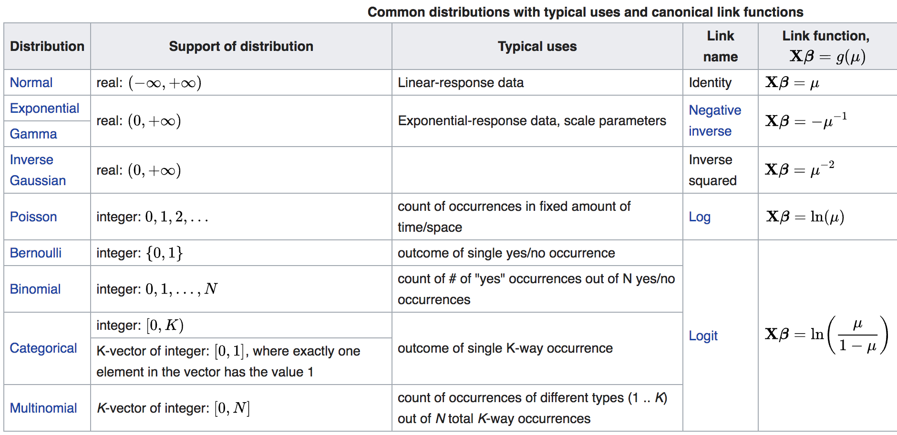
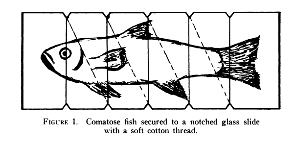

<style>
.forceBreak { -webkit-column-break-after: always; break-after: column; }
</style>

<!-- To render the lecture in Rmarkdown, enter the command below in the R console -->
<!-- rmarkdown::render("lecture25.Rmd") -->

```{r,echo=FALSE}
	#set any global options
	options(digits=3)
	set.seed(123)
```

## Model building: recap {.build}

 - we can estimate the relationship between a predictor and 
 response variable by modelling the response as a normal distribution
 where the mean is a function of the predictor
 
 - $\large \text{outcome}_i \sim \text{Normal}(\theta_i = f(\text{predictor}_i))$
 
 - we can then use Maximum Likelihood to infer
 the parameters of the deterministic function.
 

## Model building: the story so far {.build}

started with linear relationship
	
discussed nonlinear (2-parameter) deterministic functions
		negative exponential
		logistic
		power law
 
so far everything has used normal distributions 
 
## They mite be giants

```{r, out.width="650px",echo=FALSE,fig.align="center"}
	knitr::include_graphics("figs/mite_info.jpeg")
```

## Linear deterministic function w/ normally distributed errors.

```{r, echo=FALSE}
n.samples <- 150
n.mites <- sample(0:50,n.samples,replace=TRUE)
fungus.mite.beta <- -0.08
fungus.mite.alpha <- 25
fungus.mite.sigma <- 2
mean.dry.wt.fungus <- fungus.mite.alpha * exp(fungus.mite.beta*n.mites)
dry.wt.fungus <- rnorm(n.samples,mean=mean.dry.wt.fungus,sd=fungus.mite.sigma)
dry.wt.fungus[dry.wt.fungus < 0] <- 0
leaf.dmg.fungus.beta <- 1.4
leaf.dmg.fungus.alpha <- 15
leaf.dmg.fungus.sigma <- 7
lf.dmg <- function(x){
	return(15+1.4*x)
}
mean.leaf.dmg <- leaf.dmg.fungus.beta*dry.wt.fungus + leaf.dmg.fungus.alpha
leaf.dmg <- rnorm(n.samples,mean=mean.leaf.dmg,sd=leaf.dmg.fungus.sigma)
```

<div class="centered">
```{r,echo=FALSE,fig.width=5,fig.height=3.75}
par(mar=c(4,4,1,1))
plot(dry.wt.fungus,leaf.dmg,
	 main="",
	 xlab="fungus",
	 ylab="leaf damage",pch=19,col=adjustcolor(1,0.5))
```
</div>

## Linear deterministic function w/ normally distributed errors.

<div class="centered">
```{r,echo=FALSE,fig.width=5,fig.height=3.75}
par(mar=c(4,4,1,1))
plot(dry.wt.fungus,leaf.dmg,
	 main="",
	 xlab="fungus",
	 ylab="leaf damage",pch=19,col=adjustcolor(1,0.5))
abline(a=leaf.dmg.fungus.alpha,b=leaf.dmg.fungus.beta,col="blue",lwd=3)
```
</div>

$\begin{aligned}
y \sim \mathcal{N}(&\mu_i=f(x_i),\sigma) \\
&\mu_i = \beta x_i + \alpha
\end{aligned}$


## Exponential deterministic function w/ normally-distributed errors

<div class="centered">
```{r,echo=FALSE,fig.width=5,fig.height=3.75}
par(mar=c(4,4,1,1))
plot(n.mites,dry.wt.fungus,
	 main="",
	 xlab="Number of mites/cm2",
	 ylab="dry fungus weight per leaf (mg)",pch=19,col=adjustcolor(1,0.5))
```
</div>


## Exponential deterministic function w/ normally-distributed errors.

<div class="centered">
```{r,echo=FALSE,fig.width=5,fig.height=3.75}
par(mar=c(4,4,1,1))
plot(n.mites,dry.wt.fungus,
	 main="",
	 xlab="Number of mites/cm2",
	 ylab="dry fungus weight per leaf(mg)",pch=19,col=adjustcolor(1,0.5))
abline(h=fungus.mite.alpha,col="forestgreen",lwd=3)
lines(0:50 , fungus.mite.alpha * exp(fungus.mite.beta * 0:50),col="blue",lwd=3)
```
</div>

$\large 
\begin{aligned}
y_i \sim \mathcal{N}(&\mu_i=f(x_i),\sigma) \\
&\mu_i = \alpha e^{-\beta x_i}
\end{aligned}$


  
## Model building: Normal no more {.build}
```{r, out.width="350px",echo=FALSE,fig.align="center"}
	
```


 - How long do we have to wait for an empty leaf to be colonized by mites?
 
## Discussion question

Do big leaves catch mites faster? 

How can we model waiting time?

```{r,echo=FALSE,fig.width=7}
n.samples <- 1e4
leaf.area <- abs(rnorm(n.samples,6,2))
mt.time.lf.area.beta <- 0.3
mt.time.lf.area.alpha <- 1.2
mite.arrival.times <- rexp(n.samples, mt.time.lf.area.beta*leaf.area+ mt.time.lf.area.alpha)
plot(leaf.area,mite.arrival.times,xlab="leaf area",ylab="time to first mite",pch=20,col=adjustcolor(1,0.2))
```


## Modeling with the exponential {.build}

$\large \text{outcome}_i \sim \text{Distribution}(\theta_i = f(\text{predictor}_i))$

\
\

$\large \text{WaitTime}_i \sim \text{Exp}(\lambda_i = f(\text{LeafArea}_i))$

\
\

$\Large \lambda_i = \alpha + \beta \times \text{LeafArea}_i$

## Inference with the exponential

Going from: the data are **normally distributed**

```{r,eval=FALSE}
# Estimating the mean of a normal
ln.L <- function(y,mu,sigma){
	return(sum(
		dnorm(y,mean=mu,sd=sigma,log=TRUE)
	))
}
```

## Inference with the exponential

To: the data are **normally distributed**, 
with a **mean that's a function of a predictor**

```{r}
# Estimating the **parameters** of a function 
#		that determines the mean of a normal
ln.L <- function(y,x,alpha,beta,sigma){
	return(sum(
		dnorm(y,mean=alpha + beta * x,sd=sigma,log=TRUE)
	))
}
# y is the response variable
# x is the predictor variable
# alpha and beta are our intercept and slope
# sigma is the same
```

## Inference with the exponential

To: the data are **exponentially distributed** 
with a **rate that's a function of a predictor**

```{r}
# Estimating the **parameters** of a function 
#		that determines the rate of an exponential
ln.L <- function(y,x,alpha,beta){
	return(sum(
		dexp(y,rate=alpha + beta * x,log=TRUE)
	))
}
# y is the response variable
# x is the predictor variable
# alpha and beta are our intercept and slope
```


## Inference with the exponential

<div class="centered">
```{r,echo=FALSE,fig.width=5,fig.height=3.75}
par(mar=c(4,4,1,1))
plot(leaf.area,mite.arrival.times,ylab="time to first mite (hr)",xlab="leaf area",col=adjustcolor(1,0.2),pch=20)
```
</div>

$\large 
\begin{aligned}
y_i \sim \text{Exp}(&\lambda_i=f(x_i)) \\
&\lambda_i = \beta x_i + \alpha
\end{aligned}$

## Inference with the exponential

<div class="centered">
```{r,echo=FALSE,fig.width=5,fig.height=3.75}
par(mar=c(4,4,1,1))
plot(leaf.area,mite.arrival.times,ylab="time to first mite (hr)",xlab="leaf area",col=adjustcolor(1,0.2),pch=20)
text(x=11,y=3,labels=sprintf("a = %s\nb = %s",round(mt.time.lf.area.alpha,2),round(mt.time.lf.area.beta,2)),cex=2)
x <- seq(1e-3,max(leaf.area),length.out=500)
lines(x = x,y = 1/(mt.time.lf.area.alpha + mt.time.lf.area.beta*x),lwd=3,col="blue")
```
</div>

$\large 
\begin{aligned}
y_i \sim \text{Exp}(&\lambda_i=f(x_i)) \\
&\lambda_i = \beta x_i + \alpha
\end{aligned}$


## What did we just do? {.build}

A **_generalized linear model_**!

A **_generalized linear model_** is a model that allows 
response variables to have error distribution models other 
than a normal distribution.

Like a linear model, a GLM has two parts:
 
 - a deterministic component (determines the relationship between predictor and response)
 - a stochastic component (describes the distribution of "errors")
 	- aka how the likelihood of the data is calculated
 
However, a GLM also has third component: a **_link function_**

 - see next example to find out more!


## Inter-leaf variation in mite presence {.build}

```{r, out.width="650px",echo=FALSE,fig.align="center"}
	
```

## Inter-leaf variation in mite presence

 - Bigger leaves are colonized more quickly by mites than smaller leaves
 
 - Are taller plants mitier?


## Inter-leaf variation in mite presence

 - Data per plant:
 	+ Plant height
 	+ check 30 leaves
 		+ record number of leaves occupied by mites
 
 \
 
 - Do taller plants have more leaves with mites than shorter plants?
 
 - What's the relationship between plant height and mite-iness?


## Inter-leaf variation in mite presence {.build}

<div class="centered">
```{r,fig.width=6.5,fig.height=4.75,echo=FALSE}
n.samples <- 500
plant.height <- rgamma(n.samples,shape=6,rate=2)
ph.alpha <- -2
ph.beta <- 0.7
theta <- ph.alpha + ph.beta*plant.height
inv.logit.link <- function(theta){
	p <- 1/(1+exp(-theta))
}
p <- inv.logit.link(theta)
n.leaves <- 30
occ.lfs <- rbinom(n=n.samples,size=n.leaves,p=p)

par(mar=c(4,4,1,1))
plot(plant.height,occ.lfs,pch=20,
	col=adjustcolor(1,0.3),ylim=c(0,n.leaves),
	xlab="plant height",
	ylab="number of censused leaves with mites",
	main="")
```
</div>


## Inter-leaf variation in mite presence {.build}

 - How are these data distributed?
 	+ number of occupied leaves out of the 30 leaves checked
 	+ [hint: _k_ success out of _n_ trials...]

$\large y \sim \text{Binomial}(n,p)$

\

$\large y_i \sim \text{Binomial}(n=30,p_i=f(x_i))$
\
\
$p$ = probability of mite on leaf, (# of occupied leaves)/30


## Binomial regression {.build}

$\large y_i \sim \text{Binomial}(n=30,p_i=f(x_i))$

\

$\large p_i = \beta x_i + \alpha$

\

What will go wrong here?

Compare p in the binomial distribution to p in the linear equation.

## Binomial regression {.build}

$\large p_i = \beta x_i + \alpha$ \
($x_{i}$ is plant height)

\

$\large -\infty \leq \beta x_i + \alpha \leq \infty$

\

$\large 0 \leq p_i \leq 1$


## Binomial regression problems

<div class="centered">
```{r,echo=FALSE,fig.width=7.5,fig.height=5.5}
plot(plant.height,
		plant.height*ph.beta + ph.alpha,pch=20,
		col=adjustcolor(1,0.4),
		xlab="plant height",
		ylab="linear function of plant height")
	abline(h=0,col=2,lwd=3,lty=2)
	abline(h=1,col=2,lwd=3,lty=2)
```
</div>

## Link functions to the rescue!

So, instead of saying

$\Large y \sim \text{Binomial}(n,p)$

\

$\Large p_i = \beta x_i + \alpha$


## Link functions to the rescue!

We say:

$\Large y \sim \text{Binomial}(n,p)$

\

$\Large f(p_i) = \beta x_i + \alpha$

\

 - what is $f(p_i)$?

 - it's a link function!

## Link functions to the rescue!

 - A **_link function_** provides the relationship
between the predictor and a parameter of the model.

 - So, when we're building a GLM, we specify:

	+ a probability distribution
	
	+ a deterministic function
	
	+ a link function to connect them

## Link function example {.build}

$\Large y \sim \text{Binomial}(n,p)$

\

$\Large f(p_i) = \beta x_i + \alpha$

Our deterministic function has the range:

$\large -\infty \leq \beta x_i + \alpha \leq \infty$

but our parameter is constrained such that:

$\large 0 \leq p_i \leq 1$

So we want a function that maps the deterministic function to the range of the parameter.


## Link function example {.build}

### Enter the logit!

$\Large \text{logit}(x) = log \left(\frac{x}{1-x}\right)$

```{r}
logit.link <- function(p){
	x <- log(p/(1-p))
	return(x)
}
```

## Link function example {.build}

```{r,echo=FALSE,fig.width=7.5,fig.height=5.5}
p <- seq(0,1,length.out=1e5)
plot(p,logit.link(p),type='l',lwd=3,xlab="p",ylab="logit(p)")
```

$\large \text{logit}(x) = log \left(\frac{x}{1-x}\right)$

## Link functions {.build}

$\Large y \sim \text{Binomial}(n,p)$

\

$\Large f(p_i) = \beta x_i + \alpha$

\

$\Large \text{logit}(p_i) = \beta x_i + \alpha$

\

$\Large p_i = \text{inverse logit}(\beta x_i + \alpha)$


## The inverse logit {.build}

$\Large 
\begin{aligned}
log\left(\frac{p_i}{1-p_i}\right) &= \beta x_i + \alpha \\
p_i &= \frac{1}{(1+e^{-(\beta x_i + \alpha)})}
\end{aligned}$

\

```{r}
inv.logit.link <- function(x){
	p <- 1/(1+exp(-x))
	return(p)
}
```

## The inverse logit
<div class="centered">
```{r,echo=FALSE,fig.width=7.5,fig.height=5.5}
x <- seq(-100,100,length.out=1e5)
plot(x,inv.logit.link(x),type='l',lwd=3,xlab="x",ylab="inverse_logit(x) = p")
```
</div>


## The inverse logit

<div class="centered">
```{r,echo=FALSE,fig.width=7.5,fig.height=5.5}
plot(x,inv.logit.link(x),type='l',lwd=3,xlab="x",ylab="inverse_logit(x) = p",xlim=c(-5,5))
```
</div>

## Wait, how do I know what link function to use?

https://en.wikipedia.org/wiki/Generalized_linear_model#Link_function

```{r, out.width="700px",echo=FALSE,fig.align="center"}
	
```


## Binomial regression {.build}

<div class="centered">
$\Large y \sim \text{Binomial}(n,p)$

\

$\Large p_i = \text{inverse logit}(\beta x_i + \alpha)$
</div>

## Binomial regression in R {.build}

```{r}
# inverse logit link function
inv.logit.link <- function(x){
	p <- 1/(1+exp(-x))
	return(p)
}

# log likelihood function
ln.L <- function(y,x,alpha,beta,n){
	p <- inv.logit.link(alpha + beta * x)
	return(sum(
		dbinom(y,size=n,prob=p,log=TRUE)
	))
}
# y is the response variable
# x is the predictor variable
# alpha and beta are our intercept and slope
# n is our sample size
```

## Doing inference with a GLM

```{r,eval=FALSE}
# install the package
install.packages("bbmle")
```

```{r}
# load the library
library(bbmle)
```

## Binomial regression with mle2()

```{r}
# define a deterministic function
detFunc <- function(x,a,b){
	return(a + b*x)
}

# define and inverse link function
invLink <- function(z){
	p <- 1/(1+exp(-z))
	return(p)
}

# run binomial regression with mle2()
mydata <- data.frame("x"= plant.height,"y"= occ.lfs)
mod <- mle2(y ~ dbinom(size=30,
					   p=invLink(detFunc(x,a,b))
				 ),
			data=mydata,
			start=list("a"=0,"b"=0))
```

## Binomial regression with mle2()

```{r}
mod

```

## Binomial regression
We can use our model coefficients to figure out our expectations for the data based on the model
```{r, echo=T}
modelData <-  inv.logit.link(
  mod@coef[1] + mod@coef[2] * plant.height)
```

## Binomial regression
```{r, echo=T}
plot(plant.height,occ.lfs/30,col="gray", ylab = "p")
points(plant.height, modelData, col="darkred")
```


## Interpreting parameter estimates

$\large y \sim \text{Binomial}(n,p)$

\

$\large p_i = \text{inverse logit}(\beta x_i + \alpha)$

 - What does $\beta$ mean?
 
 - Recall from last lecture:
	+  $\beta$ is the **_effect size_** of our predictor variable (plant height), 
	and gives us the change in expected response variable for each unit of predictor variable.

## Interpreting parameter estimates
```{r, out.width="500px"}
mod@coef
plot(plant.height,occ.lfs/30,col="gray", ylab = "p")
points(plant.height, modelData, col="darkred")
```

## Interpreting parameter estimates

 - Using link functions affects interpretation of parameter estimates!
 
 - The change expected in the outcome variable per unit change 
 in the predictor variable is not constant across the range of the predictor
 
 - You'll discuss interpreting model output more next semester, 
 but it's always important to look at how the model is built when you 
 are interpreting output
 
 
## Is our model working?

```{r, echo=T}
mod

```

## Is our model working?
We can use our model coefficients to figure out our expectations for the data based on the model
```{r, echo=T, out.width="500px"}
modelData <-  inv.logit.link(
  mod@coef[1] + mod@coef[2] * plant.height)
plot(plant.height, modelData, col="darkred")
points(plant.height,occ.lfs/30,col="gray")
```

## Is our model working?
We can look at the differences between our model predictions and the actual data
(aka 'the residuals')
```{r, echo=T, out.width="500px"}
myResiduals = occ.lfs/30-modelData
hist(myResiduals, main="")
```
 
## Is our model working?
We can look at the residuals across the range of the predictor variable
```{r, echo=T, out.width="500px"}
plot(plant.height, myResiduals)
```
 

## Another example of GLMs: fish death

```{r, out.width="650px",echo=FALSE,fig.align="center"}
	
```


Pitkow (1960) exposed guppies to 2, 8, 12, or 18 minutes in 5 degree Celsius water. The data – with a value of 1 for Alive meaning alive and a value of zero meaning dead. 


## Group activity

Try out Binomial regression for yourself. 
\
\
Download "GLM-class-activity2024.Rmd" and go through
the exercise with your group.

## Model building recap: {.build}

 - we can plug a deterministic function into the 
 parameters of a probability distribution to estimate 
 the relationship between a predictor and response variable
 
 - $\large \text{outcome}_i \sim \text{Distribution}(\theta_i = f(\text{predictor}_i))$
 
 - we can then do inference on the parameters of that deterministic 
 function
 	+ using, e.g., Bayesian or ML inference
 
\ 
 - when we do, we're calculating the likelihood of each 
 data point as a draw from a distribution parameterized 
 by the particular value of the predictor variable associated with it.
 
## Model building recap: continued  {.build}

 - started with **linear models**
 	- (Normal distribution and linear relationship)
	
 - then added nonlinear (2-parameter) deterministic functions

 - then added non-normal distributions
 	- **generalized linear models**

## GLMs recap: {.build}

A **_generalized linear model_** is a model that allows 
response variables to have error distribution models other 
than a normal distribution.

Like a linear model, a GLM has two parts:
 
 - a deterministic component (determines the relationship between predictor and response)
 - a stochastic component (describes the distribution of "errors")
 	- aka how the likelihood of the data is calculated
 
However, a GLM also has third component: a **_link function_**

 - link functions allow you to model the parameters of different distributions 
 with different deterministic functions
 

## GLMs recap: {.build}
 
Note: a **linear model** is a _special case_ of a GLM, for which: 

 - the deterministic function is linear
 - the errors are normally distributed
 - the link function is the **identity**
 
## Model building: the future

 - multiple predictors
 
 - random effects
 
 - hierarchical models
 
 - model interpretation
 
 - model comparison
 
 - Lauren and Lais are great!
 
