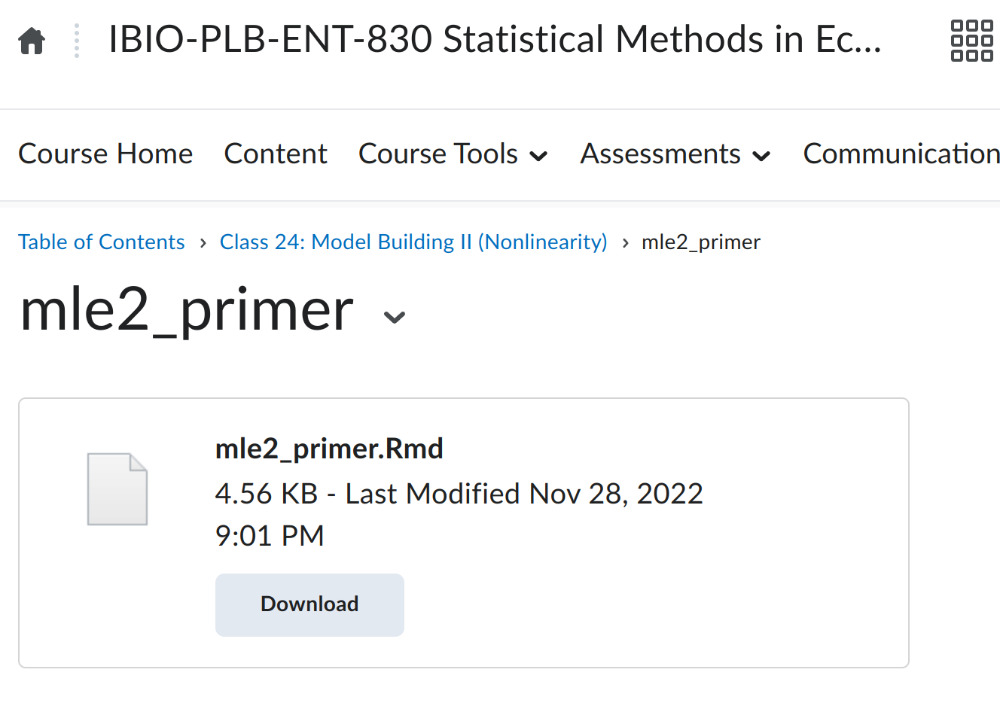

<style>
.forceBreak { -webkit-column-break-after: always; break-after: column; }
</style>

<!-- To render the lecture in Rmarkdown, enter the command below in the R console -->
<!-- rmarkdown::render("lecture25.Rmd") -->

```{r,echo=FALSE}
	#set any global options
	options(digits=3)
	set.seed(123)
	library(bbmle)
```


## Model building {.build}

 - started with **linear models**
 	- (Normal distribution and linear relationship)
	
 - then added nonlinear (2-parameter) deterministic functions

 - then added non-normal distributions
 	- **generalized linear models**

## Tuesday's class activity {.build}

- comparing a **linear model** (Normal distribution and linear relationship) 
with a model with a linear deterministic function and a non-normal (Poisson) distribution.

## Tuesday's class activity {.build}

```{r, echo=F, warning=F}
dry.wt.fungus <- runif(1e3,0,30)
mort.alpha <- -6
mort.beta <- 0.21
mortality <- rpois(length(dry.wt.fungus),lambda=exp(mort.alpha + mort.beta*dry.wt.fungus))
mydata <- data.frame("x"= dry.wt.fungus,"y"= mortality)


detFunc <- function(x,a,b){
    return(a + b*x)
}

invLink <- function(z){
    return(z)}
# run a regression with mle2()
mod <- mle2(y ~ dnorm(mean=invLink( detFunc(x,a,b)), sd=s),
            data=mydata,
            start=list("a"=0,"b"=0, 's'=1))

modData = mod@coef[1]+mydata$x*mod@coef[2]


detFunc2 <- function(x,a,b){
    return(a + b*x)
}
invLink2 <- function(z){
    return(exp(z))  
}
mod2 <- mle2(y ~ dpois(lambda=invLink2( detFunc2(x,a,b))), 
             data=mydata,
            start=list("a"=0,"b"=0)) 
## use the model to generate data
mod2Data = exp(mod2@coef[1]+mydata$x*mod2@coef[2]) 

## look at the model-predicted data curve on top of the actual data

par(mfrow=c(1,2))

## look at the model-predicted data curve on top of the actual data
plot(mydata$x, mydata$y, bty="n", col="darkgray", main="linear model")
points(mydata$x, modData,col="red",lwd=2)

plot(mydata$x, mydata$y, bty="n", col="darkgray", main="poisson model")
points(mydata$x, mod2Data,col="red",lwd=2)
  
```

## What's going on? {.build}

```{r, eval=F}
LinearModelData = mod@coef[1]+mydata$x*mod@coef[2]
PoissonModelData = exp(mod2@coef[1]+mydata$x*mod2@coef[2]) 
```

```{r, echo=F, eval=T}
par(mfrow=c(1,2))
plot(mydata$x, mydata$y, bty="n", col="darkgray", main="linear model")
points(mydata$x, modData,col="red",lwd=2)

plot(mydata$x, mydata$y, bty="n", col="darkgray", main="poisson model")
points(mydata$x, mod2Data,col="red",lwd=2)

```

## Homework {.build}

- compare a **linear model** (Normal distribution and linear relationship) 
with a model with a **nonlinear** deterministic function and a normal distribution

## Homework {.build}

```{r, eval=T, echo=F, warning=F}
load('mysteryData.Robj')

# define a deterministic function
myDet <- function(x,a,b){
    return(a + b*x)
}
# define inverse link function (it's just the identity because this is a normal regression)
myInverse <- function(z){
    return(z)
}
# run linear regression with mle2()
mod1 <- mle2(response ~ dnorm(mean=myInverse(myDet(predictor,a,b)), sd=s),
            data=mysteryData,
            start=list("a"=0,"b"=0, 's'=1))

## use the model to generate data
mod1Data = mod1@coef[1]+mysteryData$predictor*mod1@coef[2]

# define a deterministic function
myDet2 <- function(x,a,b){
    return(a*x^b)
}

# run linear regression with mle2()
mod2 <- mle2(response ~ dnorm(mean=myInverse(myDet2(predictor,a,b)), sd=s),
            data=mysteryData,
            start=list("a"=0,"b"=0, 's'=1))

## use the model to generate data
mod2Data = mod2@coef[1]* mysteryData$predictor^mod2@coef[2]

par(mfrow=c(1,2))

## look at the model-predicted data curve on top of the actual data
plot(mysteryData$predictor, mysteryData$response, bty="n", col="darkgray", main="linear model")
points(mysteryData$predictor, mod1Data,col="red",lwd=2)

## look at the model-predicted data curve on top of the actual data
plot(mysteryData$predictor, mysteryData$response, bty="n", col="darkgray", main = "exponential model")
points(mysteryData$predictor, mod2Data,col="red",lwd=2)

```

## What's going on?

```{r, eval=F, echo=T}
linearModelData = mod1@coef[1]+mysteryData$predictor*mod1@coef[2]
ExponentialModelData = mod2@coef[1]* mysteryData$predictor^mod2@coef[2]
```

```{r, echo=F, eval=T}
par(mfrow=c(1,2))

## look at the model-predicted data curve on top of the actual data
plot(mysteryData$predictor, mysteryData$response, bty="n", col="darkgray", main="linear model")
points(mysteryData$predictor, mod1Data,col="red",lwd=2)

## look at the model-predicted data curve on top of the actual data
plot(mysteryData$predictor, mysteryData$response, bty="n", col="darkgray", main = "exponential model")
points(mysteryData$predictor, mod2Data,col="red",lwd=2)

```


```

## mle2 Primer on d2l

```{r, out.width="650px",echo=FALSE,fig.align="center"}
	
```


## GLMs recap: {.build}

A **_generalized linear model_** is a model that allows 
response variables to have error distribution models other 
than a normal distribution.

Like a linear model, a GLM has two parts:
 
 - a deterministic component (determines the relationship between predictor and response)
 - a stochastic component (describes the distribution of "errors")
 	- aka how the likelihood of the data is calculated
 
However, a GLM also has third component: a **_link function_**

 - link functions allow you to model the parameters of different distributions 
 with different deterministic functions
 

## GLMs recap: {.build}
 
Note: a **linear model** is a _special case_ of a GLM, for which: 

 - the deterministic function is linear
 - the errors are normally distributed
 - the link function is the **identity**
 
## Model building: the future

 - multiple predictors
 
 - random effects
 
 - hierarchical models
 
 - model interpretation
 
 - model comparison
 
 - Will is great!
 
